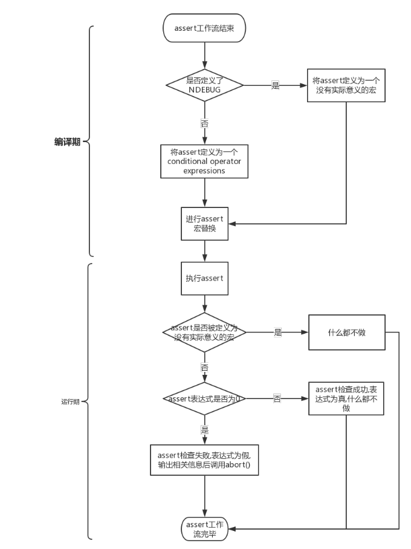

这篇笔记主要记录C++中断言和异常,以及Go中的panic和recover的特性及原理.

# C++

## 断言

结合源码来分析assert的实现方式发现,assert的实现比较简单.

assert的实现有两部分:编译期和运行期.编译期主要来控制是否要执行assert机制,以及解决一些C和CPP的处理方式差异;运行期则是处理断言表达式的值,根据值是否为0来决定处理机制.如果表达式不成立,就调用abort().abort()通过向进程发送SIGABRT信号,来触发相关的机制,一般是结束程序运行.

流程图如下:




这里放一下assert的部分源码,应该会更加清晰:

```cpp
/* "什么也不做" */
#if defined __cplusplus && __GNUC_PREREQ (2,95)
# define __ASSERT_VOID_CAST static_cast<void>
#else
# define __ASSERT_VOID_CAST (void)
#endif
```

```cpp
/* 输出 "Assertion failed",再调用abort().  */
extern void __assert_fail (const char *__assertion, const char *__file,
			   unsigned int __line, const char *__function)
     __THROW __attribute__ ((__noreturn__));
```

```cpp
/* 一个conditional operator expression*/
# define assert(expr)							\
  ((expr)								\
   ? __ASSERT_VOID_CAST (0)						\
   : __assert_fail (#expr, __FILE__, __LINE__, __ASSERT_FUNCTION))
```

## 异常

# Go

## panic

## recover