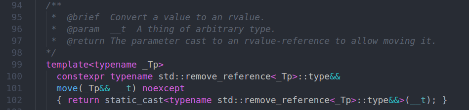

# RVO vs std::move

这篇笔记主要参考[蓝色的博客](https://www.ibm.com/developerworks/community/blogs/5894415f-be62-4bc0-81c5-3956e82276f3/entry/RVO_V_S_std_move?lang=en)

<!-- TOC -->

- [RVO vs std::move](#rvo-vs-stdmove)
    - [std::move](#stdmove)
    - [RVO](#rvo)
    - [RVO vs std::move](#rvo-vs-stdmove-1)

<!-- /TOC -->
## std::move

std::move并不是一个多么神奇的函数,没有在内部执行各种黑科技般的移动复制操作,它只是一个static_cast,把左值转换成右值引用,从而触发移动构造函数而不是拷贝构造函数.通常,我们在移动构造函数里窃取原对象的资源,并保证不再通过元对象使用资源,才能保证std::move不出任何错误.

这是std::move的实现.



## RVO

RVO(Return Value Optimization)是编译器提供的一种优化,它避免函数返回本地对象时引起复制操作.实现方式是把返回的变量直接构造在父函数的函数栈中.

RVO的触发条件是:  
* 定义调用函数时的返回值类型,和函数内部返回的变量的类型完全一致
* 不能有分支决定返回哪个变量,无论这个分支能不能在编译期确定下来

[这里](test.cpp)有RVO的示例代码

## RVO vs std::move

RVO由于不涉及构造函数的调用,直接在父函数栈上构造对象,性能方面是要优于std::move的.

所以下面这种代码,是非常愚蠢的:

```cpp

Object generate(){
    Object rv;
    return std::(rv);//本来可以触发RVO,却非要触发移动构造函数
}

```

