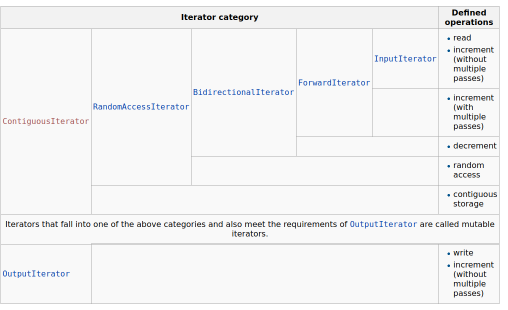
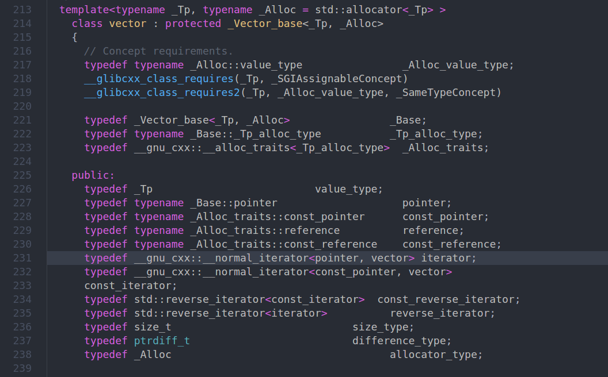
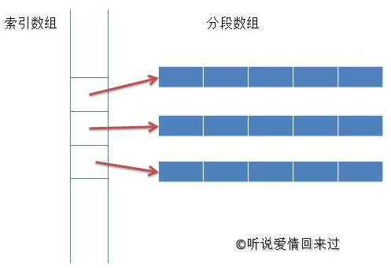
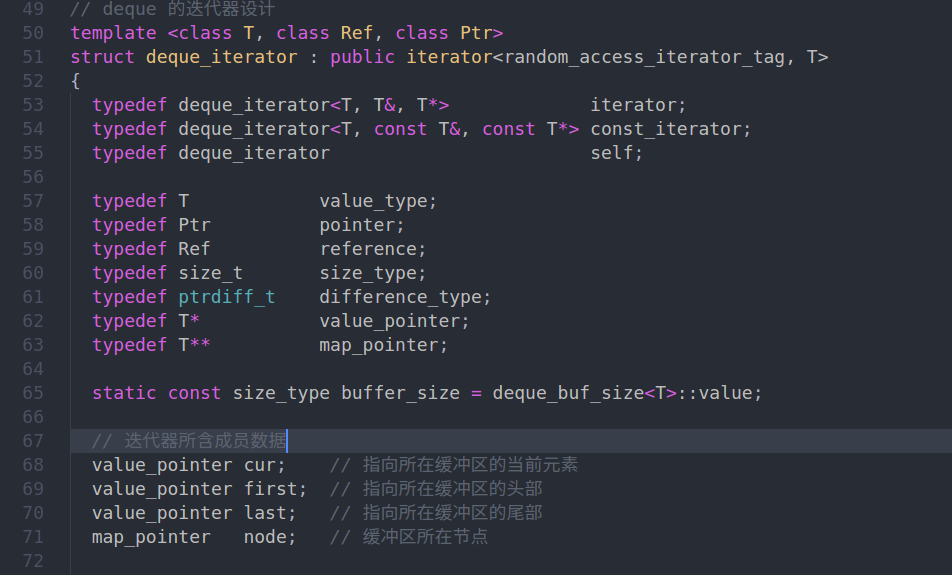

# **STL中迭代器的实现及失效问题**
<!-- TOC -->

- [**STL中迭代器的实现及失效问题**](#stl中迭代器的实现及失效问题)
    - [迭代器分类](#迭代器分类)
        - [multiple pass, single-pass](#multiple-pass-single-pass)
        - [iterators](#iterators)
    - [序列容器](#序列容器)
        - [array](#array)
        - [vector](#vector)
            - [内部细节](#内部细节)
            - [迭代器实现](#迭代器实现)
            - [迭代器失效问题](#迭代器失效问题)
        - [deque](#deque)
            - [内部实现](#内部实现)
            - [迭代器实现](#迭代器实现-1)
            - [迭代器失效问题](#迭代器失效问题-1)
        - [list](#list)
            - [内部实现](#内部实现-1)
            - [迭代器实现](#迭代器实现-2)
            - [迭代器失效问题](#迭代器失效问题-2)
        - [forward_list](#forward_list)
            - [内部实现](#内部实现-2)
            - [迭代器实现](#迭代器实现-3)
            - [迭代器失效问题](#迭代器失效问题-3)
        - [list VS forward_list](#list-vs-forward_list)
            - [insert操作](#insert操作)
        - [设计目标](#设计目标)
    - [关联容器](#关联容器)
        - [map](#map)
            - [内部实现](#内部实现-3)
            - [迭代器实现](#迭代器实现-4)
            - [迭代器失效问题](#迭代器失效问题-4)
        - [set](#set)
            - [内部实现](#内部实现-4)
            - [迭代器实现](#迭代器实现-5)
            - [迭代器失效问题](#迭代器失效问题-5)
    - [容器适配器](#容器适配器)
        - [stack](#stack)
        - [queue](#queue)
        - [priority_queue](#priority_queue)

<!-- /TOC -->
## 迭代器分类

这张图取自cppreference.

### multiple pass, single-pass

multiple pass,和single-pass是iterator的一个属性.  

* 如果某种iterator是multiple pass的,只要容器没有被改变,无论遍历多少次,从同一个iterator出发总能遍历相同的一组元素.

* 如果iteraotr是single pass的,那么从一个iterator出发,只能遍历一次元素.这种iterator适合输入输出序列的访问,只有InputIterator和OutputIterator具有这样的性质.

### iterators

c++17 之前一共有5中迭代器.

|iterator category|哪些容器实现了这种iterator|说明|
|-|-|-|
|input iterator|||
|output iterator|||
|forward iterator|std::forward_list|只能前进不能后退,但不能随机访问|
|bidirectional iterator|std::list,std::map|可以前进也可以后退,但不能随机访问|
|random-access iterator|std::array,std::vector,std::deque|可以双向随机访问|

## 序列容器

### array

内部就是一个固定长度的数组,不具备任何动态扩容的能力.

### vector

#### 内部细节

内部是一个可扩充的数组.每次insert/remove都会引起数组元素的移动或者是容量的扩充.可以说代价还是很大的.

#### 迭代器实现

vector的iterator是一个random-access iterator,从源代码上看,本质上是一个指针.

内部维护三个迭代器:  
* begin
* end
* cap  
  

#### 迭代器失效问题

如果先保存了一个迭代器,再通过某种方式增加或减少了vector的元素,之前的迭代器是不保证有效的.因为可能发生了所有元素的迁移(capacity不够用).但如果只是remove或者erase,之前保存的迭代器可能会指向原来元素的下一个元素,也可能指向末尾.

### deque

#### 内部实现

deque内部是一个索引数组,每个元素都指向一个数组.插入和删除两头元素的消耗远小于vector,但对于中间元素的插入和删除都非常消耗时间.特别的,如果频繁对中间元素进行插入和删除,会导致性能下降严重.

deque被设计成满足两端操作的容器,应该尽量避免频繁对中间元素进行删减.

下面是deque内部结构示意图.

#### 迭代器实现

deque的迭代器不能像vector那么草率,需要特别设计.并且迭代器需要维护一些关于内部细节的信息:buffer的头部和尾部,当前位置,索引节点的位置.

迭代器在buffer中移动,当到了其他buffer中的元素,需要根据索引节点来计算下一个索引节点的地址,并把内部的信息同步过去.这是TinySTL的deque迭代器的部分实现.

#### 迭代器失效问题

通过iterator的实现细节,可以看到,对于任何两端的插入删除操作,并不会影响中间元素迭代器的有效性.这里的有效性仅仅局限在dereference,而且**只保证可以访问到原来的元素**,但**不保证可顺利的迭代完所有元素和在迭代器的位置插入删除元素**.因为有可能索引数组已经被重组,迭代器维护的索引节点已经失效.

### list

#### 内部实现

一个双向链表.

#### 迭代器实现

迭代器设计非常简单,不做赘述.

#### 迭代器失效问题

list的迭代器只有一种情况下会失效:迭代器指向的元素已经被删除.

其他所有情况下,都能够从原来的迭代器开始dereference和iterator容器里的元素.

### forward_list

#### 内部实现

一个单项链表.

#### 迭代器实现

不做赘述.

#### 迭代器失效问题

除非迭代器指向的元素被删除,否则仍然可以被dereference和iterate.

### list VS forward_list

#### insert操作

包括list在内的其他序列容器,insert操作都是把元素插入到迭代器之前,但forward_list是插入到迭代器后面,主要是因为forward_list只能向一个方向迭代.

### 设计目标

forward_list的设计更偏向与性能,所以减少了指针开销,并且不提供size()成员函数.也没有什么优雅的方法来获取forward_list的大小,只能使用std::distance()来获取.

## 关联容器

### map

#### 内部实现

一般采用红黑树实现.

#### 迭代器实现

设计到红黑树的遍历,暂时不做学习.

#### 迭代器失效问题

只有删除操作才会使迭代器失效.

### set

#### 内部实现
#### 迭代器实现
#### 迭代器失效问题

## 容器适配器

### stack

### queue

### priority_queue