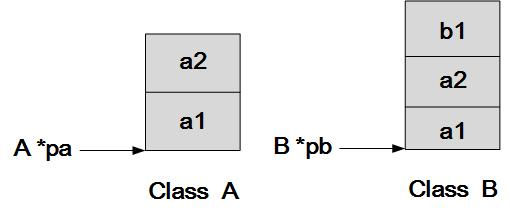
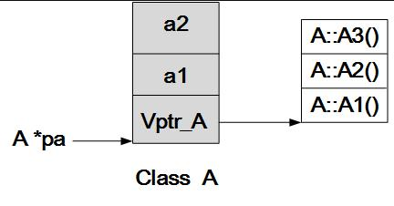
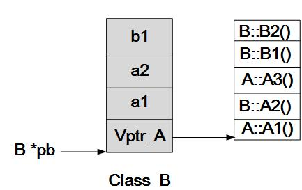

C++面向对象机制
===

本文配套有各种情况下的[内存布局测试代码](test),大部分插图来自于他人.

<!-- TOC -->

- [空类](#空类)
- [简单类](#简单类)
- [简单继承](#简单继承)
- [简单类+虚函数](#简单类虚函数)
- [单继承+虚函数](#单继承虚函数)
- [普通多继承](#普通多继承)
- [虚拟继承](#虚拟继承)
- [菱形继承](#菱形继承)

<!-- /TOC -->

## 空类

空类的大小不是0,C++编译器为空类安插一个字节.

因为C++不允许占用0字节的对象出现,所有对象都必须能够用内存地址定位.

## 简单类

简单类内的函数和变量布局如下:
|成员种类|布局方式|访问方式|
|-|-|-|
|non-static member object|跟随类对象|this指针|
|non-static member function|跟随类对象|不使用指针,由编译器处理|
|static member object|跟随类,独立存在||
|static member function|跟随类,独立存在|不使用指针,由编译器处理|

内存布局与c语言几乎相同.

## 简单继承

简单继承指不涉及到虚函数和多重继承.

子类对象含有父类对象的成员变量,并且布局上父类成员更靠前.

```cpp
class A
{
public:
	A(int a1=0,int a2=0);
	void A1();
protected:
	int a1;
	int a2;
};

class B :public  A
{
public:
	B(int a1=0,int a2=0,int b1=0);
	void B1();
protected:
	int b1;
};
```



## 简单类+虚函数

虚函数用于支持多态,子类和父类之间的虚函数调用都有自己的版本.C++需要一张表,**动态的**维护表格里的虚函数,类对象调用虚函数时都要访问这张表,来对自己对应的虚函数寻址.这也是C++面向对象的主要开销之一.

```cpp
class A
{
public:
	A(int a1=0,int a2=0){}
	virtual void A1(){c}
	virtual void A2();
	virtual void A3();
protected:
	int a1;
	int a2;
};
```



## 单继承+虚函数

由于虚函数的存在,子类也要维护一个虚函数表.大体上,虚函数表指针在类对象的首部,后面依次是父类和子类的成员变量.

如果子类没有覆盖父类虚函数,而且有自己的虚函数,那么父类和子类的虚函数依次出现在虚函数表里;如果发生了覆盖虚函数,那么虚函数表只有子类虚函数或者父类虚函数.

每次各种构造函数调用时,都会在执行第一行代码之前设置好虚函数表.这也是为什么,只要成员变量有构造函数或者虚函数,父类就必须生成一个构造函数,并在内部先调用子类的构造函数.

```cpp
class B :public  A
{
public:
	B(int a1=0,int a2=0,int b1=0);
	virtual void B1();
	virtual void A2();
	virtual void B2();
protected:
	int b1;
};
```



## 普通多继承

所有父类都存在与子类对象内存布局中,并且都有各自的一份虚函数表指针.

如果子类有自己的虚函数,那么这个虚函数放在第一个父类的虚函数表里.

如果子类覆盖了虚函数,那么所有父类的虚函数表里都会被改写.

```cpp
class Base
{
public:
 
    Base(int i) :baseI(i){};
    virtual ~Base(){}
 
    int getI(){ return baseI; }
 
    static void countI(){};
 
    virtual void print(void){ cout << "Base::print()"; }
 
private:
 
    int baseI;
 
    static int baseS;
};
class Base_2
{
public:
    Base_2(int i) :base2I(i){};

    virtual ~Base_2(){}

    int getI(){ return base2I; }

    static void countI(){};

    virtual void print(void){ cout << "Base_2::print()"; }
 
private:
 
    int base2I;
 
    static int base2S;
};
 
class Drive_multyBase :public Base, public Base_2
{
public:

    Drive_multyBase(int d) :Base(1000), Base_2(2000) ,Drive_multyBaseI(d){};
 
    virtual void print(void){ cout << "Drive_multyBase::print" ; }
 
    virtual void Drive_print(){ cout << "Drive_multyBase::Drive_print" ; }
 
private:
    int Drive_multyBaseI;
};
```


## 虚拟继承

菱形继承中,会出现子类对象含有两份祖父类对象的成员,这样会出现`内存浪费`和`二义性`的问题.所以C++提出了虚拟继承,来规避这个错误.

虚继承的特点是，**在任何派生类中的virtual基类总用同一个（共享）对象表示**.

虚拟继承通过虚基类表指针来实现这一点.这个指针指向一张虚基类表,虚基类表包含这些数据:
* 虚基类表指针相对于对象首地址的偏移量
* 最左虚基类,第二虚基类,第三,..,最右虚基类相对于虚基类表指针的偏移量.


**很遗憾的是,我并没有研究好这个问题.我的实验代码里,根本没有观察到虚基类表里的数据,我怀疑这个是编译器和平台相关的,所以不打算在研究下去了.**


## 菱形继承
