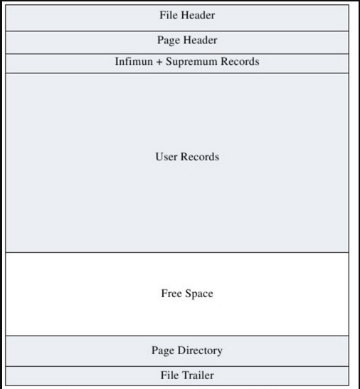

InnoDB中的页和索引
===

这篇属于学习笔记

## 页

在InnoDB中，页存在于磁盘的扇区上，也可以被读取到内存里。页主要包含四个部分，如下：
|部分|说明|
|-|-|
|FIL_PAGE_DATA_END|留白|
|PAGE_HEADER|关于这个页的一些信息，比如索引id，页内记录数量|
|记录|逻辑上是按照主键顺序排列，物理上是乱序的|
|PAGE_DIRECTORY|含有很多槽(slot),每个slot记载槽的偏移量，以及槽内含有的记录条数|
|FIL_PAGE_DATA_END|留白|

暂时没找到比较好的图，就这样凑合一下吧：

### 查找记录

InnoDB根据一些条件，从B+树种查找到了记录所在的页，进一步在页里面查找记录。

在页内查找时，首先在page directory中采用二分查找，找到槽的偏移量。再根据偏移量去中间的记录区域进行查找，进而查找到记录。

### 插入，删除，更新记录

与查找类似，首先找到页，再定位slot，最后定位记录进行修改，同时还要更行slot的信息。

### 聚簇索引和辅助索引

InnoDB有两种索引。针对主键的索引称为聚簇索引，叶子节点包含索引值和数据；针对其他自定义索引的索引称为辅助索引，辅助索引的叶子节点不包含数据，而是包含索引值和主键的索引值。

如果是通过辅助索引查找数据，要经过两次查找：第一次在辅助索引里查找主键的索引值，再在聚簇索引里查找记录。所以辅助索引也被叫做二次索引。

## B+树索引

一般的，普通二叉树、AVL树、红黑树、B\B-\B+树都可以拿来实现索引。但是，普通二叉树不具备平衡能力，很容易发生高度失控，导致搜索复杂度退化到O(N)；AVL树虽然可以保证高度在O(logN)，但是过于严格的平衡要求会导致效率低下；红黑树对于平衡的要求没有AVL树高，相应的树高度在O(logN)，但系数上是要大于AVL树的，比较适合平衡要求不那么高的场景，比如linux内核，STL等。

B树系列属于多叉树，深度相比AVL更小。在数据库应用中，由于索引页是分布在磁盘的不同未知，如果频繁的查询索引页，会带来较大的磁头移动，加大磁盘调度的开销。理所应当的，索引的实现需要一个深度尽可能小的查询树，B树系列保证了查询效率，正好可以拿来用。

B树和B-树是一样的东西，后者是B-tree的拙略翻译，B-tree就是B树。

我并没有研究B/B+树的数据结构，不是很感兴趣，也没有这个精力去弄明白。具体可以看各种博客。

B+树和B树最大的不同是：
* B树的叶子节点和非叶子节点都可存放数据，B+树只有叶子节点才存放数据。

这里的数据指，表里一个范围内的数据记录，即叶子节点上具有很多元组。

这里放上两张盗过来的图.

B树：  

B+树：

在InnoDB中，索引使用B+树实现的。之所以不用B树，原因如下：
* B树的节点可以存放记录，所以可能更大，那么一个页中，能放的节点数就变小了。映射到磁盘上，一个存储块(几个扇区)能放下的索引节点少了，那么查找的时候，需要读取的磁盘存储块也多了，这带来了更大的磁盘调度开销。
* B+树的查询效率稳定。因为只有叶子节点才有最终的数据，并且叶子都在同一层。每个key都得查到叶子节点，所以效率稳定。
* 数据库实现的B+树一般都会用链表按顺序连接好所有叶子节点，如果需要遍历整个表，B+树的效率更高。

InnoDB中，B+树索引的叶子节点可以被认为是一个页，页内包括索引值，以及这个索引范围下的所有记录。

InnoDB和MyISAM的不同在于：
* MyISAM也使用B+树，但叶子节点存放的是数据记录的指针，而不是数据记录本身。
* InnoDB的数据文件本身就是个索引文件，而MyISAM是索引和数据分离。

## 一点建议

以下建议都是理论上的，实际未经过本人测验。

* 如果没有特别需求，请直接使用自增字段来当作主键。

    因为，如果每次插入的主键都是个更大的主键，那么B+树会非常的紧凑：只有一个节点达到了装在因子(15/16)，才会继续开辟新的页。如果插入的主键是大小随机的，B+树会变得非常稀疏。就像下面这个图，现在突然要添加索引为D080的数据，就得重新调整节点的排布。这样一来就涉及到很多磁盘操作，对时间影响比较严重。  
    
    
* 写where语句请遵循最左前缀原则，并且尽量不要对索引进行一些函数和复杂的表达式筛选。

    索引可能是个复合索引，只有按照单个索引排列的顺序去比较，才能充分利用B+树索引。以前的Mysql没有那么智能，只能单纯的根据B+树的结构去搜索，如果瞎写where，查找的时候可能会走全局搜索，而不是索引查找。不过，现在的Mysql带有优化器，已经可以充分优化最左前缀了。

## reference

* MySQL内核InnoDB存储引擎
* [从B树、B+树、B*树谈到R 树](http://blog.csdn.net/v_JULY_v/article/details/6530142)
* [MySQL索引背后的数据结构及算法原理](http://www.cnblogs.com/sanwenyu/p/6129082.html)