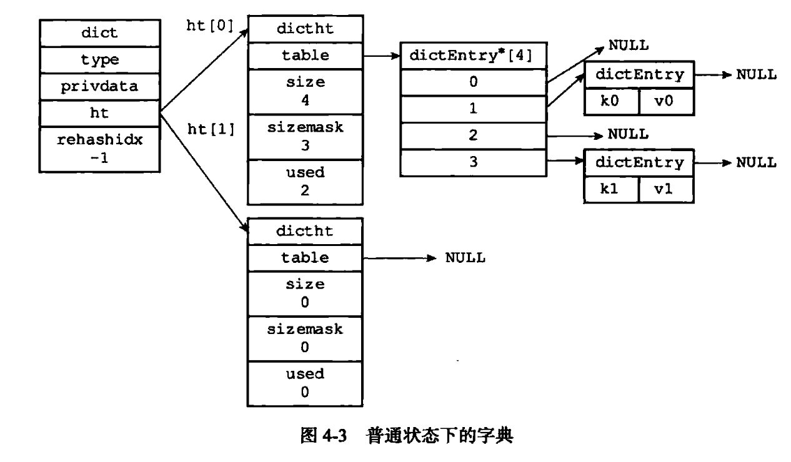

Redis字典实现原理
===

最近经常看到一些面经在谈论Java的HashMap，我不是很懂，也不想了解。但是对Redis的字典还是有点好奇的，又没时间去读源码，所以直接看了现成的源码分析。

Redis极度依赖字典。在STL和linux内核中，如果有类似存储键值对的需求，一般都采用红黑树。但是红黑树毕竟有个O(logN)的查找过程，有点难以接受。

Redis采用hash表来实现字典。结构如下：
```
typedef struct dictht{

//hash表数组
dictEntry **table;

//容量
unsigned long size;

//哈希表大小掩码，用于计算索引值
unsigned long sizemask;

//已用容量
unsigned long used;

}dictht;


```

Redis的hash表根据key，计算hash(key)&sizemask，即是hash表的索引值。如果发生了hash冲突，就采用简单的链式方法来解决。

字典是用hash表实现的，其结构如下：
```c
typedef struct dict{

    dictType *type;

    // 包含一些私有的数据，比如键值比较函数等
    void *privdata;

    //2个hash表
    dictht ht[2];

    //rehash索引
    int rehashidx;
}dict;
```

字典包含两个hash表，一个是正式使用的，一个用于再hash。正常添加/删除key-value时，就是直接在ht[0]上操作。如果发现需要扩容或者收缩，就先分配一个新的hash表给ht[1]，再把旧数据都拷贝过来，销毁ht[0]后，把ht[1]赋值给ht[0]。




简单来说，扩容和收缩的条件如下：
* 如果负载因子大于等于1，需要进行扩容
* 如果负载因子小于0.1，需要收缩

其中，负载因子=已有键值对的个数/hasa表大小

扩容/收缩后的hash索引如何重新计算呢？hash表的sizemask字段随size改变而改变，新的hash表将使用新的sizemaks来计算hash索引，从而使所有的老键值对都能落在新的索引范围内。

还有个特性叫做`渐进式rehash`。由于数据规模问题，当键值对很多时，如果发生了rehash，一次性完成rehash带来的开销是很大的。因为各种内存分配、拷贝带来的延迟会堆积在一起，违背了redis作为缓存的设计目标。所以Redis采用渐进式的rehash，每次对字典进行操作时，会附带上一部分rehash的工作，把部分旧数据迁移到新的hash表里，直到某次操作完成了所有的rehash工作。


参考资料：

* [Redis设计与实现](https://book.douban.com/subject/25900156/)