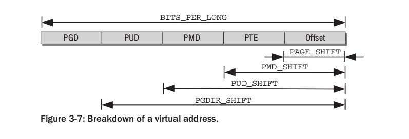

Linux内核的内存管理机制(三)之 地址翻译的细节
===

本文属于内核学习系列中一段,主要描述Linux管理进程内存的机制.

本文将回答如何从虚拟地址转化成物理地址.

<!-- TOC -->

- [mm_struct,vm_area_struct,page的关系](#mm_structvm_area_structpage的关系)
- [多级分页机制](#多级分页机制)
- [用户进程的虚拟地址转化成物理地址](#用户进程的虚拟地址转化成物理地址)
- [缺页异常处理程序如何被触发](#缺页异常处理程序如何被触发)
- [内核的虚拟地址转化到物理地址](#内核的虚拟地址转化到物理地址)
- [内核的虚拟地址转化到struct page](#内核的虚拟地址转化到struct-page)
- [struct page转换到物理页的首地址](#struct-page转换到物理页的首地址)

<!-- /TOC -->


## mm_struct,vm_area_struct,page的关系

<!-- 笔记写到这里,也应该说清楚:**用户进程的虚拟内存如何转化为物理内存**. -->

用户进程含有自己的地址空间(mm_struct,一个进程内一个),地址空间内有自己的内存区域(vm_area_struct,一个地址空间内多个).内存区域不一定被映射到了page,只有内存区真的被访问,产生了缺页中断,内核才会为它分配page结构.可以说,mm_struct,vm_area_struct之间有直接的包含关系的,但page相对于二者显得比较独立.

page一般通过全局指针mem_map来访问,本文后续部分将进行说明.

## 多级分页机制

linux为内存建立了一套分级机制,保证进程虚拟地址到物理地址的转化速度快,并且占用内存小.分级的思想不再赘述,相关资料太多了.这里直接介绍linux关于多级分页的数据结构.

linux采用四级分页机制,虚拟地址被划分四部分:

|Global Dir|Upper Dir|Middle Die|Table|offset|
|-|-|-|-|-|
|页全局目录|页上级目录|页中间目录|页表|偏移量|




至于每个部分有几位,具体位的用途,要根据具体平台来决定.x86_64体系下,内核代码这样反映:
```c
typedef struct { unsigned long pte; } pte_t;
typedef struct { unsigned long pmd; } pmd_t;
typedef struct { unsigned long pud; } pud_t;
typedef struct { unsigned long pgd; } pgd_t;

typedef struct { unsigned long pgprot; } pgprot_t;/*保护标志*/

#define pte_val(x)	((x).pte)
#define pmd_val(x)	((x).pmd)
#define pud_val(x)	((x).pud)
#define pgd_val(x)	((x).pgd)
#define pgprot_val(x)	((x).pgprot)
```

## 用户进程的虚拟地址转化成物理地址

用户进程的虚拟地址只能通过page table entry来转化.

对于一个虚拟地址,内核一步步从页全局目录查到页表,得到page table entry的地址.page table entry一般占用unsigned long大小的空间,高位部分给出虚拟页号对应的物理页号,低位部分给出相关的权限信息.有了物理页号之后,就可以加上原虚拟地址的偏移量部分,得到真实的物理地址.

## 缺页异常处理程序如何被触发

一般的CPU架构都会提供一个MMU,即内存管理单元,负责内存翻译,缓存控制等工作.Linux内核只需要设置好页表,MMU自己会完成翻译工作.注意,页表在内存里,而某些平台下的页表缓存(page look- buffer)在CPU内的MMU中,访问速度远快与访存.同时,页表的访问应该也不是一般的访存流程,并且是平台相关的,故不做研究.

当CPU执行一条指令,需要根据地址去读写内存.假设是用户进程在执行,由于指令里是虚拟地址,MMU会根据页表去查找page table entry,再翻译成实际的物理地址.

如果在查找页表的过程中,发现某个项并不存在(某一级指向第0页),或者找到了page table entry却发现相关状态标志不符合要求(不可读,不可写,不合法等),MMU会指出这样的错误,并通知内核,内核再调用调用相关的错误处理程序.

后续会专门研究缺页中断问题.

## 内核的虚拟地址转化到物理地址

用户进程需要维护自己的page table,因为各自的地址空间使用情况不同,必须独立维护;内核进程不需要自己维护一个page table,因为所有的内核代码共享一个地址空间,直接使用全局策略即可.

对于一个32位的虚拟地址空间,应用程序使用低3G的地址,内核使用高1G的地址.这种设计是为了隔离二者的地址空间,从而使内核轻松区分用户进程是不是在尝试访问内核地址.内核编译的时候应该是带有一些选项,使得程序的地址从PAGE_OFFSET开始.

在32位系统中,如果内存真实大小为4G,内核就占用高1G的虚拟地址空间.这时的内核虚拟地址翻译途径取决于虚拟地址:

* 虚拟地址大于3G,小于3G+896MB,采用线性的映射方法,及物理地址=虚拟地址-PAGE_OFFSET.
* 虚拟地址大于3G+896MB,采用动态的分页方法.动态分页将把大于3G+896MB的内存映射到RAM的其余部分.

可以看到,内核并不能直接访问大于3G+896MB的物理地址,因为线性偏移的法则不适用了.这时,内核就会使用内核页表来完成地址翻译工作,间接访问大于3G+896MB的物理地址.这样的机制也允许内核使用高段内存部分的地址去接触到更多的内存.


## 内核的虚拟地址转化到struct page

page作为一个重要的结构,需要经常被访问.比如,要计算虚拟地址所属的物理页正在被多少进程使用,肯定需要找到虚拟地址对应的struct page,访问page->users字段.

不考慮高端內存,內核的虚拟地址转化到struct page地址的代码如下:

```c
/*线性映射,直接减偏移量*/
#define __pa(x)			((unsigned long)(x)-PAGE_OFFSET)

/* 通过数组直接索引到目标page结构体
 * mem_map是全局的struct page的数组首地址,pfn是物理页的编号
 * */
#define pfn_to_page(pfn)	(mem_map + (pfn))

/*接受内核虚拟地址,转化成对应struct page的地址,返回的也是内核虚拟地址*/
#define virt_to_page(kaddr)	pfn_to_page(__pa(kaddr) >> PAGE_SHIFT)

```

## struct page转换到物理页的首地址

计算出page相对于mem_map的偏移量,再换算即可.