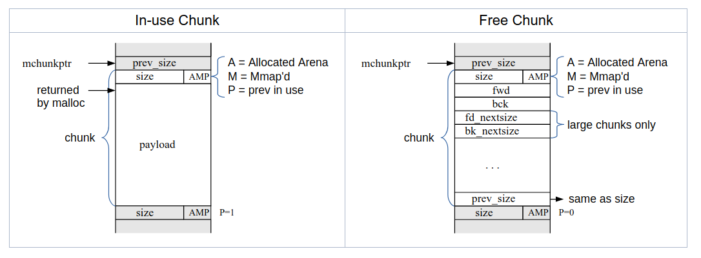
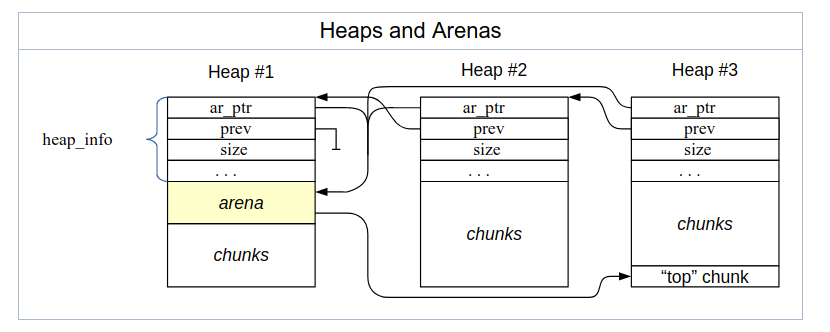

malloc,free的实现方式
===


<!-- TOC -->

- [malloc/free与linux内核的关系](#mallocfree与linux内核的关系)
- [内核如何管理堆](#内核如何管理堆)
- [malloc详解](#malloc详解)
	- [Chunk](#chunk)
	- [Arenas and Heaps](#arenas-and-heaps)
	- [malloc算法](#malloc算法)
	- [free算法](#free算法)
	- [realloc算法](#realloc算法)
- [reference](#reference)

<!-- /TOC -->

## malloc/free与linux内核的关系

malloc/free并不属于内核,他们是GNU项目提供的独立用户级API.内核提供do_brk()作为一个内核级接口,用于动态改变堆的大小;GNU项目实现了libc,libc把brk()封装起来,加上一些内部机制,封装成malloc/free函数族给用户使用,这里的用户指**使用gcc编译器族的c/c++语言的开发者**.malloc不一定会触发系统调用,因为malloc会获取内核有关进程地址空间的信息,再在内部维护一系列的数据结构,用来管理用户进程对堆的使用.只有malloc内部机制无法满足用户需求时,才会发起系统调用,申请扩充堆的内存区域.

需要说明的是,malloc不会触发页的分配.只有进程真正访问了页,触发缺页中断,才会导致内核真正为堆的内存区域分配页.

malloc就是一种间接的系统调用.如果malloc触发了do_brk()系统调用,它需要接触到内核的地址空间,所以需要陷入内核态来完成.陷入内核一般伴随着进程上下文切换,所以还是有一定代价的.

## 内核如何管理堆

在我的学习过程中,并没有找到太多关于内核如何管理堆的资料.大多比较简洁,就像是一点微不足道的小事,花两三页就完成了.

我现在想明白了,内核对于堆的管理确实"不涉及"太多数据结构.

进程要使用堆,需要面对这些问题:  
* 堆的地址映射到哪些物理页
* 指令发出的虚拟地址如何转换成物理地址
* 使用哪些虚拟地址作为堆的地址

第一个问题由缺页中断负解决,缺页中断会建立好映射关系,为虚拟地址分配物理页.

第二个问题由页表机制解决.

前两个问题早已经被内核委托出去了,所以内核管理堆时只需要做这样一点工作:改变堆的虚拟地址范围.即时调整堆对应的vm_area_struct结构.

内核通过do_brk()来调整堆的大小.
```c
unsigned long do_brk(unsigned long addr, unsigned long len);
```

do_brk()大致做这样的几件事情:

* 检查调整堆会不会破坏内存的相关限制,包括是不是有足够的物理页,进程的虚拟地址使用情况是不是超出限制.
* 如果堆的内存区域后面有连续的,可用的内存区域,那么选择直接扩展堆的内存区域.
* 否则,创建一个全新的内存区域,并把旧内存区域的地址映射关系迁移到新内存区域.

do_brk()说起来很简单,实现代码包括空白加注释也只有100行,实际上会涉及到用户态陷入内核态,slab机制,vm_area_struct细节等其他问题,好在我不需要研究的这么深入.

## malloc详解


### Chunk

malloc把一大块内存分为若干相邻的chunks,使用boundary tag机制来维护chunk.

malloc使用指针mchunkptr指向一个chunk,使用malloc_chunk结构来描述一个chunk:

```c
struct malloc_chunk {

  INTERNAL_SIZE_T      mchunk_prev_size;  /* Size of previous chunk (if free).  */
  INTERNAL_SIZE_T      mchunk_size;       /* Size in bytes, including overhead. */

  struct malloc_chunk* fd;         /* double links -- used only if free. */
  struct malloc_chunk* bk;

  /* Only used for large blocks: pointer to next larger size.  */
  struct malloc_chunk* fd_nextsize; /* double links -- used only if free. */
  struct malloc_chunk* bk_nextsize;
};

typedef struct malloc_chunk* mchunkptr;
```



malloc_chunk数据域有点复杂,下面一一解释.

* size和AMP  
	chunk的大小是8字节的整数倍,所以可以省出3位来表示另外的信息(AMP标志).在用来表示本chunk长度的字中,末三位分别表示:A (NON_MAIN_ARENA),表示这个chunk不属于主arena;P (PREV_INUSE),表示前一个chunk被分配出去了,正被用户使用;M (IS_MMAPPED),表示这个chunk属于的arena是通过mmap函数产生的匿名映射区,而不是一个正经的堆区.
* prev_size  
	如果当前chunk(记为a)的前一个chunk(记为b)没有被用户使用,即P位置0,那么a的前一个字,也就是b的最后一个字,描述了b的大小.
* fwd,bck  
	如果当前chunk空闲,这两个字段表示双向链表相关的信息.否则无效.
* fd_nextsize,bk_nextsize  
	如果当前chunk空闲,并且是个很大的chunk,这两个字段才有效,也是用于表示双向链表相关的信息.


### Arenas and Heaps

arena的意义在于服务多线程应用.多线程可以共享一个堆,但是会存在同步问题.如果多个线程随意使用malloc,对同一个heap进行操作,肯定会出现问题.所以每个线程都有多个单独的arena,专门服务与这个线程的malloc调用;线程也会保留对初始arena(main arena)的引用,确保可以共享初始的堆内存.

malloc默认设置下,arena数量是CPU数量的8倍.

malloc使用struct malloc_state来表示一个arena:
```c
struct malloc_state
{
  /* Serialize access.  */
  __libc_lock_define (, mutex);

  /* Flags (formerly in max_fast).  */
  int flags;

  /* Fastbins */
  mfastbinptr fastbinsY[NFASTBINS];

  /* Base of the topmost chunk -- not otherwise kept in a bin */
  mchunkptr top;

  /* The remainder from the most recent split of a small request */
  mchunkptr last_remainder;

  /* Normal bins packed as described above */
  mchunkptr bins[NBINS * 2 - 2];

  /* Bitmap of bins */
  unsigned int binmap[BINMAPSIZE];

  /* Linked list */
  struct malloc_state *next;

  /* Linked list for free arenas.  Access to this field is serialized
     by free_list_lock in arena.c.  */
  struct malloc_state *next_free;

  /* Number of threads attached to this arena.  0 if the arena is on
     the free list.  Access to this field is serialized by
     free_list_lock in arena.c.  */
  INTERNAL_SIZE_T attached_threads;

  /* Memory allocated from the system in this arena.  */
  INTERNAL_SIZE_T system_mem;
  INTERNAL_SIZE_T max_system_mem;
};
```



arena使用几个链表来维护自己的空闲chunks,分别是:
* fast bins  
	包含几组按大小排序好的chunks.
* unsorted bins  
	chunk被free后,默认放入这个链表.
* small bins  
	包含几组chunks,每组chunks大小相同.
* large bins  
	包含几组chunks,每组chunks大小不同并且比较大.

### malloc算法

malloc按照size大小进行策略选择,大致如下:

1. 如果size足够大,直接使用mmap系统调用来分配地址
2. 否则,如果fastbins中有合适的chunk,直接使用.
3. 否则,如果smallbins中有合适的chunk,直接使用.
4. 否则,如果size较大,把fastbins合并到smallbins,并合并相邻的chunk.
5. 把unsorted bins合并到smallbins,合并相邻chunk.如果途中遇见一个合适大小的chunk,直接使用之.
6. 其他.


### free算法

free不代表物理内存被归还给操作系统,仅仅说明相应的地址变得对本程序可用.

只有当被释放的内存块是mmap直接产生的,才会调用unmmap,归还物理地址.否则,还是把内存块插入到几个bins里,并试图合并相邻的chunk.

### realloc算法

raalloc的工作是改变内存块大小,同时保持原内容不变.我觉得使用非常少,所以不再探究下去了.

## reference

[malloc internals](https://sourceware.org/glibc/wiki/MallocInternals)