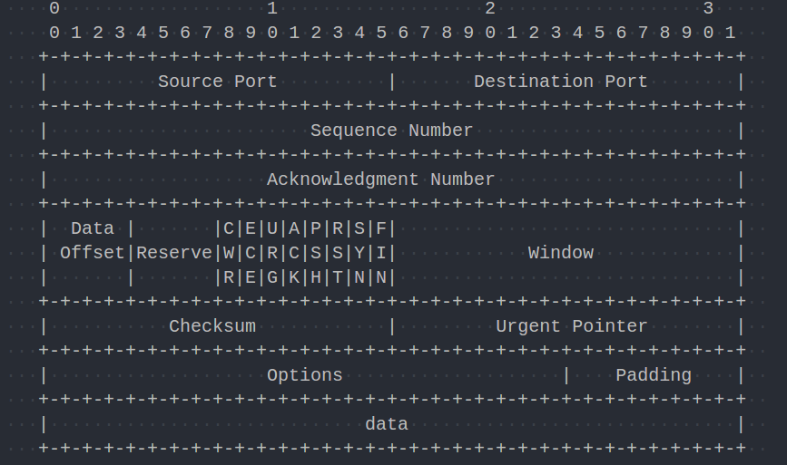

最近在写数据库的轮子,当前正处于写CS模型的阶段,发现有很多问题没有透彻的了解,写出来的CS不理想,所以重新学习一遍TCP协议.

全部内容来自与TCP/IP协议详解卷一:协议.

<!-- TOC -->

- [1. TCP初步](#1-tcp初步)
    - [1.1. TCP的必要性](#11-tcp的必要性)
        - [1.1.1. 根本问题：信道不可靠](#111-根本问题信道不可靠)
        - [1.1.2. 接受方是否已经接受到分组？](#112-接受方是否已经接受到分组)
        - [1.1.3. 接受方收到的分组是不是和发送方发出去的一样？](#113-接受方收到的分组是不是和发送方发出去的一样)
        - [1.1.4. 如果控制发送数据包的速率？](#114-如果控制发送数据包的速率)
    - [1.2. 一些可以解决问题的概念](#12-一些可以解决问题的概念)
        - [1.2.1. 分组窗口，滑动窗口](#121-分组窗口滑动窗口)
        - [1.2.2. 变量窗口：流量控制，拥塞控制](#122-变量窗口流量控制拥塞控制)
        - [1.2.3. 超时重传](#123-超时重传)
        - [1.2.4. TCP的头部](#124-tcp的头部)
- [2. TCP连接管理](#2-tcp连接管理)
    - [2.1. TCP连接的建立与终止](#21-tcp连接的建立与终止)
        - [2.1.1. 三次握手与四次握手](#211-三次握手与四次握手)
        - [2.1.2. TCP半关闭](#212-tcp半关闭)
        - [2.1.3. 同时打开与关闭](#213-同时打开与关闭)
        - [2.1.4. 初始序列号](#214-初始序列号)
    - [2.2. TCP路径最大传输单元(MTU)](#22-tcp路径最大传输单元mtu)
    - [2.3. TCP状态转换](#23-tcp状态转换)
        - [2.3.1. 状态转换图](#231-状态转换图)
        - [2.3.2. TIME_WAIT状态](#232-time_wait状态)
        - [2.3.3. SO_REUSEPORT 和 SO_RESUEADDR](#233-so_reuseport-和-so_resueaddr)
- [3. TCP超时与重传](#3-tcp超时与重传)
- [4. TCP数据流与窗口管理](#4-tcp数据流与窗口管理)
- [5. TCP拥塞控制](#5-tcp拥塞控制)
- [6. TCP保活机制](#6-tcp保活机制)

<!-- /TOC -->

# 1. TCP初步

## 1.1. TCP的必要性

这里列举一些问题，以说明引入TCP协议的重要性。
### 1.1.1. 根本问题：信道不可靠

在巨大的网络系统中，有一个致命问题：信道不可靠。也就是说，你不知道当前的设施能不能帮你完成数据传输。对于可能出现的差错(丢包，重复包，被修改了的差错包)，我们有两种方法来解决：使用差错校验码来纠正通信问题，自动重复请求(Automatic Repeat Request)。

### 1.1.2. 接受方是否已经接受到分组？
### 1.1.3. 接受方收到的分组是不是和发送方发出去的一样？
### 1.1.4. 如果控制发送数据包的速率？

## 1.2. 一些可以解决问题的概念

### 1.2.1. 分组窗口，滑动窗口

首先，我们把要传输的数据进行分组，每个分组都有一个序列号。传输数据端和接受数据端各自维护一个窗口结构。

通过这个窗口，两端可以看到三种分组：已经发送且确认的分组，正在发送的分组(正在等待确认，或正在发送)，尚未发送的分组。这样的窗口就是**分组窗口**。

随着数据的流动，一个又一个分组被发送且确认，窗口也在移动：它将显示新的三种分组，三种分组在向已经发送且确认的方向移动。这就是**滑动窗口**。

### 1.2.2. 变量窗口：流量控制，拥塞控制

上面提到的滑动窗口只存在位置的移动，可以跟踪整个数据流，但并没有说明数据流的速度。一个合理的传输速率，可以充分发挥发送端/接受端的性能。

当接受方的处理速度跟不上发送方，只有降低发送方的传输速率。这就是所谓的**流量控制**。流量控制有两种方法：

* 基于速率，即限制发送方的速率
* 基于窗口更新，即两端协商后决定窗口的大小，协商出一个处理速率

经过窗口更新后，双方会调整窗口大小，事双方都不至于跟不上速率。但是，中间网络可能出现差错：网络链路速度低，路由器内存不足等。所以还需要顾及到中间网络的能力，否则可能会导致丢包问题。解决这个问题的方法称为**拥塞控制**。

### 1.2.3. 超时重传

TCP协议是基于重传的，可以用来解决某些数据包丢失的问题。那么，怎么区分丢失的包和往返时间长的包？

从发送放到接受方再到发送放的往返时间(Round Trip Time，RTT)是不确定的，随着真实的网络情况而波动。我们需要一个RTT值来区分丢失的包和往返时间稍长的包，这个值一般是基于统计的。

如果RTT太大，会导致网络空间变得空闲，降低网络吞吐量;如果RTT太小，会导致重发的包太多，使网络空间十分拥挤。

### 1.2.4. TCP的头部
                                     
  

|字段|大小|备注|用途|
|-|-|-|-|
|Sequence Number|32位|以字节为单位|用来标注当前报文段的数据中，第一个字节的序列号。这个序列号会随着数据流循环增加|
|Acknowledgment Number|32位|以字节为单位，只有ACK有效时才有效|用来标明，当前这个ACK的发送方，所期待的下一个序列号。即是最后一个被成功接受的字节的序列号+1|
|Data offset|4位|以32位字为单位||
|Window|16位|以字节为单位||

# 2. TCP连接管理

## 2.1. TCP连接的建立与终止

### 2.1.1. 三次握手与四次握手

这里不想记录，相关资料太多了。只强调两个地方：

* SYN和FIN都会消耗一个序列号。  
* 主动开启方和被动开启方都会维护序列号，所以一共是有两个序列号，被双方各自表明所期待的下一个接受的报文段的序列号。这两个序列号的初始值为ISN(c)，ISN(s).[这里](./seq-num-during-tcp-stream)有两个序列号的观察例子。

### 2.1.2. TCP半关闭

一般是使用系统调用shutdown()，来达到这样一种效果：调用方不再发送数据，但希望还能够接受数据。落实到协议底层上，应该是调用放发送的FIN数据包中，含有其他的标志/选项，通知接收方：只需要确认这个FIN，而不需要发回FIN来完全终止连接。

这种半关闭并不常见，一般的应用程序还是通过系统调用close()来实现正常的四次握手关闭。

### 2.1.3. 同时打开与关闭

这种情况更不常见。

连接双方都有一个地址+端口号，几乎同时发送SYN请求。3次握手变成了4次，双方同时承担服务器、用户的角色。

### 2.1.4. 初始序列号

一个TCP连接是由四元组(主动连接方的IP和端口，被动连接方的IP和端口)唯一确认的，所以有可能出现一个连接的不同实例。比如，一个实例关闭后，下一个连接在完全相同的四元组上建立，就产生了另一个实例。

这样会带来一个困扰，即上一个实例中迟到的数据，被当成是当前实例的数据。所以需要有一种方式，来避免两个实例的序列号产生重叠，而导致数据被伪造。当前的TCP实现，都会采用一个时钟关联的函数，来保证序列号的随机性和安全性。

## 2.2. TCP路径最大传输单元(MTU)

Max Transport Unit: 两个主机间路径的所有网络报文段中的最D大传输单元的最小值。

Max Segment Size: TCP提交给IP层的最大分段大小，之包括TCP payload，不包括TCP选项和头部。

首先需要注意这几点：
* 知道MTU可以帮助我们更好的选择报文段大小,避免分片
* 一条路径上，两个方向的MTU是不同的
* MTU是动态变化的

但是，MTU并不需要开发者手工探测，TCP协议已经默认帮我们处理好，会自动进行探测和调整。

## 2.3. TCP状态转换

### 2.3.1. 状态转换图

首先要明确的是，这个图必须牢记于心，每日一画！

### 2.3.2. TIME_WAIT状态

TIME_WAIT状态的存在是为了避免这样的情况：被动关闭方，接受到FIN并发回了ACK，这时，被动关闭方要继续发送一个FIN，并期望得到一个ACK。这是，主动关闭方收到被动方发来的FIN，并回复一个ACK，进入**TIME_WAIT状态**.这个状态是为了等待一件事情：被动方没有收到ACK，而重新发送了FIN，

### 2.3.3. SO_REUSEPORT 和 SO_RESUEADDR

当一个<addr，port>被两个套接字同时监听(listen),当这个<addr，port>接受多个连接时，会分发到不同的套接字里，而且分发无规律。

这可以当成：一个服务器的多个实例，运行在同一个监听地址<addr，port>上。

# 3. TCP超时与重传

# 4. TCP数据流与窗口管理

# 5. TCP拥塞控制

# 6. TCP保活机制 