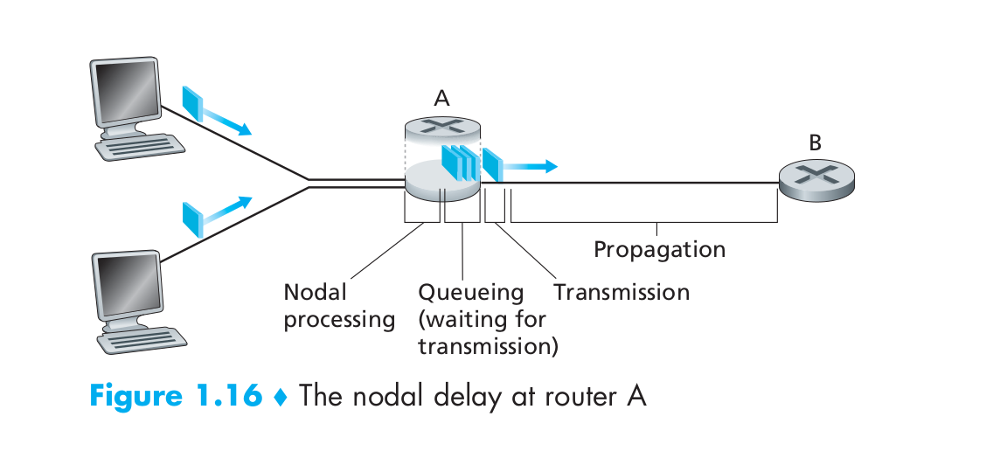
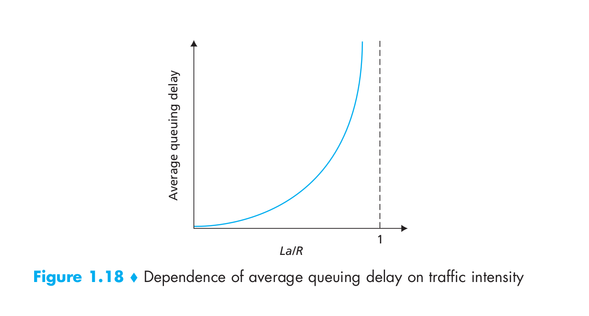

网络性能:时延,丢包与吞吐量
-------------------------

这篇笔记记录几个重要网络性能指标的意义及相互关系,内容主要来自于**计算机网络:自顶向下方法1.4节**.

<!-- TOC -->

- [1. 时延(delay)](#1-时延delay)
    - [1.1. 介绍](#11-介绍)
    - [1.2. 处理延迟(processing delay)](#12-处理延迟processing-delay)
    - [1.3. 排队延迟(queuing delay)](#13-排队延迟queuing-delay)
    - [1.4. 传输延迟(transmission delay)](#14-传输延迟transmission-delay)
    - [1.5. 传播延迟(prapagetion delay)](#15-传播延迟prapagetion-delay)
- [2. 排队延迟与丢包(queuing delay and packet loss)](#2-排队延迟与丢包queuing-delay-and-packet-loss)
    - [2.1. traffic intensity与平均延迟](#21-traffic-intensity与平均延迟)
    - [2.2. 丢包](#22-丢包)
- [3. 吞吐量(throughput)](#3-吞吐量throughput)
- [4. 出口带宽,入口带宽对于丢包的影响](#4-出口带宽入口带宽对于丢包的影响)
- [5. 存储转发(store and forward)](#5-存储转发store-and-forward)

<!-- /TOC -->

# 1. 时延(delay)

## 1.1. 介绍

在分组交换网络(Packets Swtiched Network)中,数据分组的传递存在几个方面的延迟,分别是:

* nodal processing delay  
    节点处理延迟,与路由器处理性能有关.

* queuing delay  
    数据包排队等待延迟,与数据包的实际情况有关.

* transmission delay  
    传输延迟

* propagation delay  
    传播延迟
    

在一个传输节点上,数据分组的总延迟(**nodal delay**)就是上述几个延迟的总和,可以简单的认为总延迟是在毫秒(ms)级别的.

当路由器接受到上游发来的数据包,路由器会检查数据包的头部信息,选择合适的路由线路,也就是这个路由器自己的出口端口(outbound link).如果这个**出口端口正忙**(正在被使用,即有其他的数据包正在发送,或者是有其他的数据包正出在这个端口的等待队列中),**新到达的数据包就会进入等待队列**,等待被传输.当然,如果队列太大超过限制,数据包就会被丢失.

## 1.2. 处理延迟(processing delay)

这段延迟用于检查数据包的头部信息,检查数据传输是否出错,并选择好最佳路由线路.

在这段时间的末尾,路由器会把数据包放到路由端口的队列中去.

## 1.3. 排队延迟(queuing delay)

取决与有多少数据分组正在等待队列中等待.要注意的是,**队列中数据包的处理顺序并不一定是先到先服务**.

## 1.4. 传输延迟(transmission delay)

这个延迟就和出口带宽相关了.一个L大小的数据包,在出口带宽为M的情况下,需要L/M时间才能够被传输完毕(发送到出口信道中).

## 1.5. 传播延迟(prapagetion delay)

取决与传输距离和传输介质.

# 2. 排队延迟与丢包(queuing delay and packet loss)

排队延迟受到数据包情况(大小,数量等)的影响.如果队列中有一批数据包,第一个数据包的排队延迟和最后一个数据包肯定不同,我们一般对平均延迟,延迟方差,特定延迟时间的概率等指标感兴趣.

## 2.1. traffic intensity与平均延迟

假设一个容量无限大的路由队列中每秒到达的数据包个数为a,数据包大小都为L,我们称La/R为**traffic intensity**,这个变量反映了路由的拥堵情况.队列s数据包的平均延迟与La/R相关性大概如下图

可以看到,如果La/R接近1,平均延迟将会非常大.如果对应到DNS请求包(数据包的大小非常接近),这里的La/R就类似与每秒发包数.

## 2.2. 丢包

如果路由队列大小有限,路由器就会丢弃溢出的数据包.可怕的是,**路由器丢掉溢出的数据包后,不会通知发送方**.

# 3. 吞吐量(throughput)

吞吐量就是单位时间内传输完成的数据大小,如果服务器向客户端发送了F bit数据,使用了T 秒,那么平均吞吐量就是F/T bps.

吞吐量与延迟是两个方面的性能标准.延迟考虑的是一个数据包从发送到被接受消耗的时间,一般对实时处理系统比较重要;吞吐量考虑的则是,要传输的所有数据包从发送到被完全接受需要多长时间,对文件传输系统比较重要.

**端之间**的吞吐量取决与**端之间各节点**的吞吐量,并且存在短板效应.在C/S结构中,即使中间节点的传输速率(带宽)再高,如果客户端和服务器的传输速率低,也无法充分发挥网络性能. 

# 4. 出口带宽,入口带宽对于丢包的影响

最后来考虑老师提出的这个问题.要明确的是,应该始终考虑路由器队列的使用情况.

如果出口带宽大于等于入口带宽,那么不会发生丢包,因为无论入口带宽的使用情况如何,队列都能够被及时清空;如果出口带宽小与入口带宽,只有持续充分使用入口带宽,造成了队列溢出,才会有丢包.如果入口带宽的使用频率小,即使出口带宽小于入口带宽,路由器也能利用等待队列来存储数据包,再进行转发.

# 5. 存储转发(store and forward)

**对于packet swtiching网络,数据包的传输是要等待整个包到达才能开始的**.

比如,最底层的传输介质是光纤,发一个信号(bit)需要一定时间,而一个数据包又由很多bit组成,所以路由器要全部接受到一个数据包一定是有时间延迟的.只有当这个数据包的所有bits完全到达,才会进入路由器节点处理过程,经过节点处理延迟后再进入后续过程.