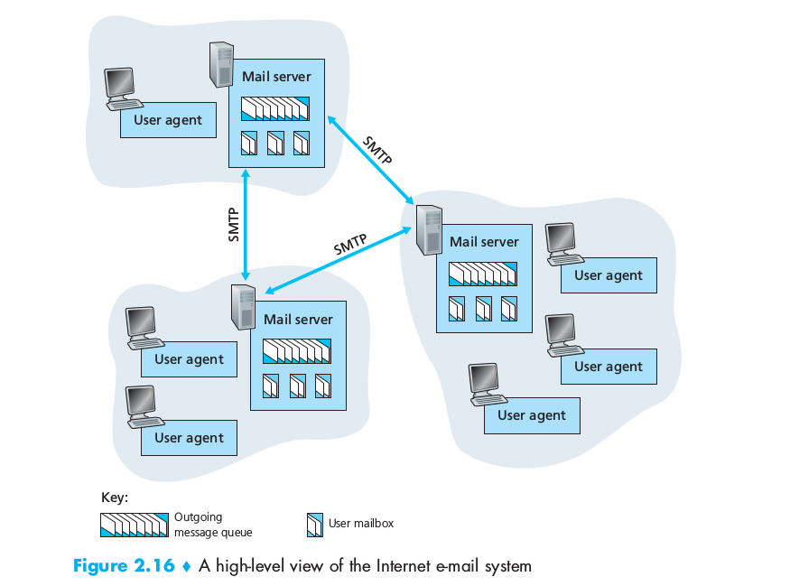
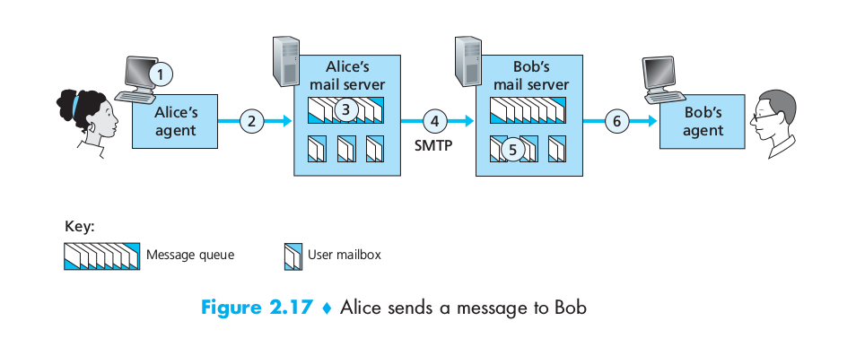

Internet中的邮件传输协议
------------------------------------------------

这篇笔记记录Internet中的邮件传输协议,内容主要来自于**计算机网络:自顶向下方法2.4节**.

<!-- TOC -->

- [1. 基本概念](#1-基本概念)
- [2. SMTP](#2-smtp)

<!-- /TOC -->

# 1. 基本概念

这张图基本涵盖了所有基本概念:

* User Agent
    User agent是用户代理,就是我们一般使用的邮件客户端,如126邮件web页面,网易邮箱大师等.这种代理软件允许我们对邮件进行各种编辑,编辑完成后把邮件发给邮件服务器,及Mail server.

* Mail Server
    Mail Server是邮件传输的主要节点,它内部有一个Outging mailqueue,服务器对队列里的每个待发送邮件进行处理,找到邮件目的服务器,将邮件装发给它.这个过程没有任何中间方,就是两个Mail server的直接交互.

* SMTP  
    SMTP是MailServer之间交互的协议.

* User mailbox
    在mail server上,每个邮箱用户都会对应一个User mailbox,里面维护着发给这个用户的所有邮件,等待用户通过User agent上线后,发给用户.
    

# 2. SMTP

这里有一个邮件传输的具体例子,事件按标号顺序发生

需要注意的有:

* SMTP不存在中间人  
    通信双方直接通过一条TCP连接来交换信息,如果连接发生错误,则由发送方重传整个邮件.

* SMTP是一个比较古老的协议  
    这个协议传输时采用ascii编码,不存在二进制数据,所以无法多媒体数据必须经过特殊的decode过程才能通过SMPT传输(HTTP则可以直接传输二进制数据).

* SMTP把一封邮件作为一个整体来传输  
    不像HTTP,一个网页里的多个对象(图片,文本)各自具有自己的HTTP请求过程.SMPT中的一封邮件包含的所有数据都在一次SMTP通信中.

* SMTP只用于mail server之间的邮件传输  
    User agent和Mail server之间另有传输协议(POP3,IMAP等).
    

