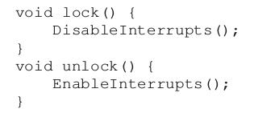
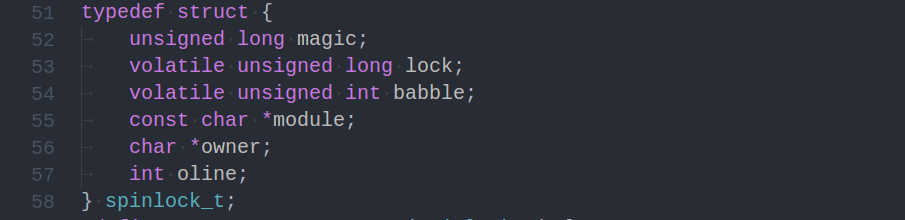

Operating Systems: Three Easy Pieces
=====================================

这是OSTEP的并发部分章节的笔记.

<!-- TOC -->

- [1. chapter 26, Concurrency: An Introduction](#1-chapter-26-concurrency-an-introduction)
    - [1.1. threads](#11-threads)
    - [1.2. Shared Data](#12-shared-data)
    - [1.3. Atomicity](#13-atomicity)
- [2. chapter 27, Interlude: Thraed API](#2-chapter-27-interlude-thraed-api)
- [3. chapter 28, Locks](#3-chapter-28-locks)
    - [3.1. Locks:The Basic Idea](#31-locksthe-basic-idea)
    - [3.2. Evaluating Locks](#32-evaluating-locks)
    - [3.3. 第一种实现:Contorlling Interrupts](#33-第一种实现contorlling-interrupts)
    - [3.4. 第二种实现:SpinLock,Test and Set(Atomic Exchange)](#34-第二种实现spinlocktest-and-setatomic-exchange)
    - [3.5. 第三种实现:SpinLock,Compare and Swap](#35-第三种实现spinlockcompare-and-swap)
    - [3.6. 第四种实现:TicketLock,Fetch and Add](#36-第四种实现ticketlockfetch-and-add)
    - [3.7. 第五种实现:Using Queues,Sleeping Instead Of Spinning(Solaris,Linux)](#37-第五种实现using-queuessleeping-instead-of-spinningsolarislinux)
    - [3.8. 第六种实现:Two Phase Locks(Linux)](#38-第六种实现two-phase-lockslinux)
- [4. chapter 29, Lock-based Concurrent Data Structures](#4-chapter-29-lock-based-concurrent-data-structures)
    - [4.1. Concurrent Counters(traditional or sloppy)](#41-concurrent-counterstraditional-or-sloppy)
    - [4.2. Concurrent Lists(traditional or hand-over-hand)](#42-concurrent-liststraditional-or-hand-over-hand)
    - [4.3. Concurrent Queues(traditional or head-and-tail)](#43-concurrent-queuestraditional-or-head-and-tail)
    - [4.4. Concurrent Hash Table(traditional or lock-per-bucket)](#44-concurrent-hash-tabletraditional-or-lock-per-bucket)
- [5. chapter 30, Condition Variables](#5-chapter-30-condition-variables)
    - [5.1. pthread_cond_wait,pthread_cond_signal,pthread_cond_broadcast](#51-pthread_cond_waitpthread_cond_signalpthread_cond_broadcast)
        - [5.1.1. Mesa Semantics,Hoare Semantics](#511-mesa-semanticshoare-semantics)
        - [5.1.2. 为什么wait需要传递一个mutex作为参数?](#512-为什么wait需要传递一个mutex作为参数)
        - [5.1.3. 已经有了pthread_cond_signal机制(在C++中反映为notify()),为什么需要一个状态变量,来反映条件成立?](#513-已经有了pthread_cond_signal机制在c中反映为notify为什么需要一个状态变量来反映条件成立)
        - [5.1.4. 为什么使用while而不是if来检测条件?](#514-为什么使用while而不是if来检测条件)
    - [5.2. 生产消费问题](#52-生产消费问题)
        - [5.2.1. 为什么不使用lock](#521-为什么不使用lock)
        - [5.2.2. 为什么使用两个condvar](#522-为什么使用两个condvar)
- [6. chapter 31, Semaphores](#6-chapter-31-semaphores)
    - [什么是semaphores](#什么是semaphores)
    - [semaphores as lock](#semaphores-as-lock)
    - [semaphores as condvar](#semaphores-as-condvar)
    - [生产消费问题](#生产消费问题)
    - [读写锁](#读写锁)
    - [哲学家就餐](#哲学家就餐)
- [7.  chapter 32, Common Concurrency Problems](#7--chapter-32-common-concurrency-problems)
- [8. Event-based Concurrency](#8-event-based-concurrency)

<!-- /TOC -->

# 1. chapter 26, Concurrency: An Introduction

## 1.1. threads

简单介绍下线程.

线程与进程十分相似,都是一种对CPU的抽象.相比与进程,线程更加轻盈.比如,同一个进程内的线程发生切换时,不必切换PageTable,也不必切换PageLookasideBuffer.线程也是调度器的工作对象.同一个进程内,所有的线程共享同一个code,stack段,但各自拥有独立的stack.与process的PCB相似,thread具有TCB.

需要强调的是,线程的运行顺序没有任何规定,完全取决与调度器的调度算法及当时的工作状态.这里有一个[例子](./examples/thread-schedule).

## 1.2. Shared Data

thread 虽然带来了一种更轻便的CPU虚拟化,但也带来了一些问题.最明显的是Shared Data问题.

由于调度的先后顺序未知,如果几个线程同时对一个变量进行裸露的读写操作,很可能由于读写顺序的打乱而造成结果错误的情况.

读写顺序的打乱是由于线程的读写操作未完成就用玩了时间片,丢失cpu控制权.以简单的 ```count=count+1``` 为例子,汇编如下:
```as
  40070e:       8b 05 40 09 20 00       mov    0x200940(%rip),%eax        # 601054 <x>
  400714:       83 c0 01                add    $0x1,%eax
  400717:       89 05 37 09 20 00       mov    %eax,0x200937(%rip)        # 601054 <x>
```

## 1.3. Atomicity

如果每一次读写都不被打断,shared data带来的问题就可以避免.我们需要一种保证操作能够完全完成,或根本就不执行的属性:原子性.下面在介绍几个重要的名词,他们都是由Dijkstra提出来的,与原子性有关.

* critical section  
    临界区.临界去区是一段代码/指令,这段代码试图访问共享变量(shared variable).显然,这样的代码不能并发执行.
* mutual exclusion  
    互斥.互斥是一种性质,它保证统一时间,无论有多少个线程正在执行,都只能有一个线程处于临界区.
* race condition  
    竞态条件.当多个线程试图同时进入临界区,就发生了竞态条件.一般会导致操作失败,结果不正确.
* synchronization primitives  
    同步原语.由硬件和操作系统共同提供的机制,确保代码的原子性.


# 2. chapter 27, Interlude: Thraed API

全是基本的api使用,跳过本章大部分内容.只留下一个Thread API Guidelines,这里摘录几条.

* Keep It Simple and Stupid.
* 减少线程间的交互!
* 尽量减少共享变量的使用!

# 3. chapter 28, Locks

这一章主要是关于同步锁及其实现.

## 3.1. Locks:The Basic Idea

到目前,我们没有任何用来干预进程或线程调度(以下统一称为线程调度)的工具,也就是说,线程调度完全取决与调度器(scheduler).谁先执行,执行多就,全部又scheduler根据历史数据和当前环境来选择.

这样一来,就有了上一章中的data race的问题,也就是涉及到同步和互斥的问题.我们认为,线程之间有三种关系:
* 同步  
    线程之间存在依赖关系,如输入线程和计算线程和输出线程.
* 互斥  
    多个线程试图进入同一个临界区,会发生data race.
* 没关系  
    完全不存在关系.

最后一种忽略不计,我们需要一种来控制线程间同步互斥关系的工具,也就是**锁**.当线程要进入临界区,必须先打开一把(也可能是多把)锁,如果锁打不开,就不能进入.当然,锁只能被打开一次,直到打开锁的线程重新施放了锁,这把锁才能被重新打开.锁(Lock)只是借用了我们生活中常说的锁的概念而已,工作原理则不同.Lock一般具有两种操作:acquire/release,也叫做lock/unlock.

这里也不多说,锁用的已经够多了,记下这么多就够了.

## 3.2. Evaluating Locks

从现在开始,我们主要集中与如何实现锁这个特别的数据结构.先介绍三种衡量锁的角度:

* Can provide mutaul exclusion or not?  
    是否能保证所有线程只能有一个进入临界区?
* Can promise for fairness or not?  
    是否可以保证所有线程都能进入临界区,而不造成某些线程一直处在starving的状态?
* How about performence?  
    lock和unlock的操作大概要占多长时间?

## 3.3. 第一种实现:Contorlling Interrupts

如果是在单核CPU环境下,要想保证mutual exclusion,就必须保证其他线程不会抢走cpu.我们知道,线程调度是通过timeout的形式触发中断,将控制权还给OS,OS再选择下个线程来实现的.如果timeout中断不被处理,就不会发生线程切换了.所以,我们只需要在线程进入临界区前,屏蔽终端.核心思想如下图:



这种方式的缺点很多.首先,只能在单CPU下工作,显然在如今是不合适的;其次,关中断的操作需要更高的权限,所以需要一种特别的提权机制,来保证关终端开中断的顺利进行;最后,据说对于开关中断的操作,执行起来会比较慢.

## 3.4. 第二种实现:SpinLock,Test and Set(Atomic Exchange)

现在,我们添加一个标志位,来反映锁的工作状态.首先看看初步的Test ans Set算法.
```c
typedef struct __lock_t {
    int flag
} lock_t;

void init(lock_t *mutex){
    mutex->flag=0;
}

void lock(lock_t *mutex){
    while(mutex->flag==1) 
        ;
    mutex->flag=1;
}

void unlock(lock_t *mutex){
    mutex->flag=0;
}

``` 

可以看到,在lock的时候,如果锁已经被占用,lock()就会陷入循环,直到有人释放了这个锁.这种循环状态成为**spin-wait**,尽管线程在这个地方循环,相当与一种阻塞,但线程并没有让出CPU,而是占用CPU不断检查flag状态.

同时也有一个很大的问题:两个线程可能同时跳出循环(初始状态,两个线程通过了test,要进入临界区).这还是由于那个根本问题,CPU被抢占,指令操作未完成.所以,我们还需要一种硬件支持,来保证这个lock操作是原子性的.

很多硬件提供了这样的原子性指令,如x86下的xchg,SPARC下的ldstub,都统一叫做**test-and-set**,工作细节如下:

```c
int TestAndSet(int *ptr,int new){//这个函数是原子性的,不可被中断
    int old=*ptr;
    *ptr=new;
    return old;
}
```
test-and-set指令完成了test和set的功能,如果锁已经被占用,set仍然成功,但test得到的值却依然是旧值.使用test-and-set的lock()大致如下:
```c
void lock(lock_t *mutex){
    while(TestAndSet(&mutex->flag,1)==1)
        ;
}
```

这种锁称为自旋锁(**spin lock**).显然,这个lock可以保证mutual exclusion,但是却不能保证fairness和performence.

## 3.5. 第三种实现:SpinLock,Compare and Swap

一些硬件还提供另外的支持,也就是compare-and-swap.工作细节如下:

```c
int CompareAndSwap(int *ptr,int expected,int new){//这个函数同样是原子性的
    int actual=*ptr;
    if (actual==expected)
        *ptr=new;
    return actual;
}
```
## 3.6. 第四种实现:TicketLock,Fetch and Add

硬件提供这样的指令支持:
```c
int FetchAndAdd(int *ptr){//原子性
    int old=*ptr;
    *ptr=old+1;
    return old;
}
```

锁的机制变了很多,lock内有一对turn和ticket,分别表示当前轮到的号码,以及当前发放到的门票号码.当轮到的号码经过unlock增长后,ticket与之相等的lock()即可获得锁.

```
typedef struct __lock_t {
    int turn;
    int ticket;
} lock_t;

void lock(lock_t* mutex){
    int myturn=FetchAndAdd(&mutex->ticket);//领取门票,门票记录自动增长
    while(myturn!=mutex->turn)
        ;
    return
}

void unlock(lock_t* mutex){
    FetchAndAdd(&mutex->turn);
}

```

这样的算法好在,保证fairness:**每个试图获得锁的线程,最终都能够获得之**.但性能方面并没有什么改变:当一个线程获得了锁,其他线程试图lock()时,会陷入到spin-wait中.

## 3.7. 第五种实现:Using Queues,Sleeping Instead Of Spinning(Solaris,Linux)

为了避免spin-wait,线程应该自己申请进入等待状态(Block),获得锁的线程释放锁时,再将它唤醒.当然,不能采用简单的sleep(n),因为等待的时间不可控,并且太多线程一起醒来还是会造成类似的spin-wait.所以需要一种系统调用,能让线程主动进入block,而且能够被动唤醒.

Solaris有一对系统调用:park(),unpark(threadID).使用这对API(保证performance),在加上队列(保证fairness),以及原子性指令(TestAndSet,保证互斥),就可以完成一个比较好的lock实现方式.具体细节如下:

```c
typedef struct __lock{
    int flag;
    int guard;
    queue *q;
}lock_t;

void init(lock_t *mutex){
    mutex->flag=0;
    mutex->guard=0;
    queue_init(mutex->q);
}

void lock(lock_t *mutex){
    while(TestAndSet(&mutex->guard,1)==1) //如果不能获的guard的锁,即有线程正在修改队列q,应该自旋等待
        ;

    //获得了guard锁,可以修改队列了
    if(mutex->flag==0){//锁空闲,可直接获得
        mutex->flag=1;
        mutex->q=0; //释放队列锁
        return;
    }else{//锁被其他线程获得,应该陷入block,等待唤醒
        queue_add(mutex->q,gettid());
        mutex->q=0;//释放队列锁
        pack();
    }
}

void unlock(lock_t *mutex){
    while(TestAndSet(&mutex->guard,1)==1)
        ;
    if(queue_empty(mutex->q)){//没有其他线程试图获得这个锁
        mutex->flag=0;
    }else{//有其他线程因为或的这个锁而被pack,需要唤醒
        unpack(queue_remove(mutex->q));
    }
    mutex->guard=0;

}

```

这里分别解释下lock和unlock的细节.  
    guard是队列锁,只有获得了队列锁,才能进入下一步lock,否则陷入spin-wait.好在对于队列的操作耗时较短,不会产生大量的spin-wait现象.  
    
有个致命的地方:lock中,pack()之前可能产生race condition.比如,当前线程要pack了,队列锁也已经施放,却用玩了time slice,CPU被其他线程抢占.如果这个新上来的线程,执行了unlock操作,而队列中又只有上个线程,那么上个线程被unpack,同时锁被标记为realease,队列清空.然后等上个线程获得了CPU,继续从pack()开始执行,一进入pack,就不可能再被唤醒了(锁已经被标记为realease,下个试图获得锁的线程将直接获得锁),与是永远陷入pack.

当然,Soloris也有相应的解决办法.它用setpack代替pack,使线程pack之前先看看,是不是已经没有其他线程占用锁,如果是,就直接恢复正常执行状态,重新调用lock,获得锁.

Linux也有类似的机制,比如futex_wait,futex_wake.这个机制在```lowlevellock.h```中有体现.值得一提的是,futex.h等相关文件中,大量使用汇编来实现锁,为的就是减小中断的影响.Linux源代码中也有spinlock.c,有空可以看看[kernel/locking/spinlock.c](https://github.com/torvalds/linux/blob/master/kernel/locking/spinlock.c),里面太多的宏定义,还涉及到多核CPU的情形.

这里放张图,linux-2.6版本的spinlock_t



## 3.8. 第六种实现:Two Phase Locks(Linux)

这种锁对于spin-wait的理解不同,它认为spin-wait是有用的.直接避免spin-wait是不对的,相反,应该先尝试spin-wait一段时间,再进入block状态.

Linux的锁将loxk分为两段时期.第一段只是进入spin-wait,预定时间内还没获得锁就退出第一段,再次检查是否可以或的锁,如果可以就返回,否则进入第二段,陷入pack,等待被唤醒.

# 4. chapter 29, Lock-based Concurrent Data Structures

## 4.1. Concurrent Counters(traditional or sloppy)

Concurrent Counters就是一个支持并发的计数器.计数器可读可写,并且带有阻塞的锁操作.

* Traditional Counters  
    不同版本直接给count一个全局锁,所有线程试图操作该count时,都要lock该全局锁.这样就会造成几个线程等待一个线程的情况.注意,Linux采用的是二段锁实现,所以第一段的spin-wait是不可避免的,也就是说,多个线程操作一个锁时,无法避免的会出现等待时间浪费.  
* Sloppy Counters   
    SloppyCOunters引入了buffer的概念,每个线程维护一份全局counter的镜像,加减操作都直接操作这个镜像counter,只有加减操作到达了一定次数(threshold),或发生了对全局counter的read操作,才会试图获得全局锁,进行数据同步.这样大大减少了spin-wait的次数.

这里有[两个实现](./examples/concurrent-counter),计算不同线程数下,每个线程执行相同counter add操作的总运行时间.sloppy版本的trenshold取为5.

|线程数量|add次数|sloppy counter用时|traditional counter用时|
|:-:|:-:|:-:|:-:|
|1|10000000|0.130323|0.327724|
|2|10000000|0.304245|2.70485 |
|3|10000000|0.387101|3.58324 |
|4|10000000|0.730623|6.92834 |
|5|10000000|0.876632|8.56112|

## 4.2. Concurrent Lists(traditional or hand-over-hand)

Concurrent List也差不多,可以通过全局锁的形式,提供并发支持.

但全局锁的性能并不好.可以通过**hand-over-hand**的形式来提供更细粒度的并发支持.hand-over-hand就是给每个list元素提供一把锁,允许多个线程同时对list进行操作,当然,不能是同时对同一个元素进行操作.hand-over-hand也不足,因为需要考虑lock的空间负载,以及lock,operation,unlock的运行速度负载.

**如果有一天需要造这种轮子,还是得先查查相关的论文**.

## 4.3. Concurrent Queues(traditional or head-and-tail)

可以通过添加全局锁来实现,也可以通过头尾各一把来实现.后者的并发程度更高.

## 4.4. Concurrent Hash Table(traditional or lock-per-bucket)

可以通过添加全局锁来实现,也可以通过每个bucket各一把来实现.后者的并发程度更高.

# 5. chapter 30, Condition Variables

lock可以用来避免race condition,但不可避免的会因为自旋而产生cpu时间浪费.同时,我们也有很多这样的需求:线程等待某个条件满足了,才能够执行下去.比如消费者只有等生产者生产才能消费.所以,需要有这样一种机制:先让线程block,等条件满足了再来唤醒它,即是条件变量.

## 5.1. pthread_cond_wait,pthread_cond_signal,pthread_cond_broadcast

先说明,**pthread_cond_signal唤醒一个waiter,pthread_cond_broadcast唤醒所有waiter**.

这里解释几个事情.
   
### 5.1.1. Mesa Semantics,Hoare Semantics

Mesa Semantics:signal(或者叫notify)并不代表running!常见的os都是这种方式.

Hoare Semantics:signal(或者叫notify)后立即进入running!

结合进程三基本状态即可理解.


### 5.1.2. 为什么wait需要传递一个mutex作为参数?

因为,wait不是一种原子性的内和调用.也就是说,wait可以被中断.**wait的内部细节是,(a)将当前线程加入挂起等待队列,释放mutex,(b)自旋等待,试图获取signal,(c)成功获取signal,处理内部数据细节,重新获取mutex**.如果没有这个mutex,执行wait的线程可能被执行signal的线程中断,在成功进入等待队列前,先一步完成notify的操作.当wait线程重新进行时,就会陷入无限的等待.所以,必须要加入一个锁,来保证wait中**进入等待队列操作**的的原子性.  
所以,wait一定要和mutex结合来用.

### 5.1.3. 已经有了pthread_cond_signal机制(在C++中反映为notify()),为什么需要一个状态变量,来反映条件成立?  
即使wait有mutex来帮助保证原子性,还是不够的.因为,wait()仅仅负责等待队列的进入离开等相关操作,只看是不是有其他线程调用了pthread_cond_signal,不负责具体条件的成立与否.如果wait线程和signal线程产生后,signal先执行,先尝试唤醒等待的线程(但wait线程还没开始执行,没有进入等待队列),后续的wait线程如果不先检测状态变量,就会一头撞进等待队列,再也出不来.  
所以,cv一定要使用一个状态变量.

### 5.1.4. 为什么使用while而不是if来检测条件?  

* 首先,wait有可能失败.失败后,应该重新检测,而不是就此放过.

* 其次,wait正常返回时(被notify了),wait线程知道条件已经满足了,所以准备下一步工作.但巧的是,其他wait线程也wake up了,先一步进行了下一步工作,导致条件不成立(比如生产消费问题).当切换回第一个wait线程,条件已经不成立,但程序却按成立继续进行,所以会发生错误.

总的来说,**条件变量一定要结合锁和状态标志变量来使用**.


## 5.2. 生产消费问题

说两个问题.

### 5.2.1. 为什么不使用lock

如果使用最初的mutex来控制并发,可能产生死锁(consumer试图从空buffer中获取元素,同时获得mutex,与是producer无法获得mutex,放入元素),即使使用多个mutex,也会产生类似问题(consumer获得了所有锁,又试图从空buffer中获取元素,producer与是又无法或的mutex).

所以要找新思路:使用条件变量来解决.

### 5.2.2. 为什么使用两个condvar

一个的话并发性不高.

因为buffer肯定不能只有一个位置.如果有多个位置,因为生产消费的速度不同,所以要允许各自有**产能过剩**和**消费饥渴**的情况发生.

# 6. chapter 31, Semaphores

## 什么是semaphores

信号量是一种并发控制工具,它在内部维护一个数,主要提供init,post和wait三个操作.
* init()  
    init初始化信号量内部的数.
* wait()  
    wait将信号量内部的数减一.在减操作执行前,如果当数大于0,调用wait会直接返回,继续后面的操作;否则,调用wait会使程序阻塞,线程转入block状态.在这两种情况下,wait返回之前,会将内部数减一.
* post()  
    post将信号量内部的数加一.加操作完毕后,如果内部数大于0,post会唤醒一个因为wait()而阻塞的线程,将它变为ready状态.

其实,semaphores最大的好处是,**可以进程间共享**.

## semaphores as lock

这种锁又叫binary semephores.例子在[这里](./examples/semaphores/as-lock.cpp).

## semaphores as condvar

例子在[这里](./examples/semaphores/as-semaphores.cpp).

## 生产消费问题

例子在[这里](./examples/semaphores/produce-consume.cpp).

需要说明的是,如果想控制buffer的最大容量,需要改变wait和post的方式.

## 读写锁

例子在[这里](./examples/semaphores/read-write-lock.cpp).

这个实现有个缺点:writelock比readlock难获取.因为一旦有reader获得了锁,后续的reader可以直接获得,writer则必须等待所有的reader完成read.我想到的解决办法是,添加一个队列来维护陷入等待的writer和reader信息.如果一个reader要获得锁,必须没有等待中的writer排在它前面,才可以获得;如果一个writer要获得锁,必须没有等待中的reader排在它前面.这样一来,可以严格按照请求锁的时间顺序来分配锁.为了维护时间顺序,需要在内部维护序列号.这样的话,就有点像条件变量的实现方式了,并且这个实现太复杂了,得不偿失.

## 哲学家就餐

这个问题实际上对于三种同步工具(lock,condvar,semaphores)是通用的.由于哲学家拿筷子的顺序相同(先左后右),所以会造成死锁.我们只要改变其中一个人的拿筷子顺序,就可以避免死锁.

# 7.  chapter 32, Common Concurrency Problems

# 8. Event-based Concurrency