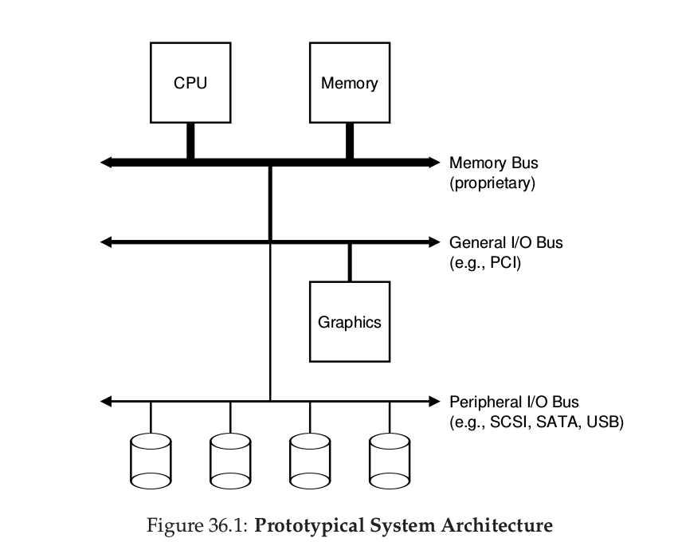
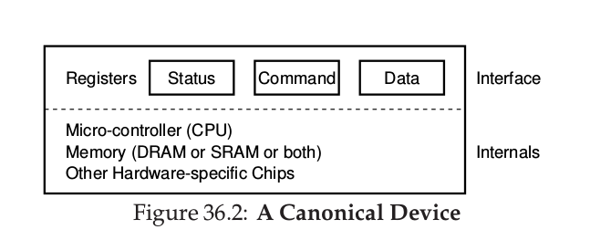
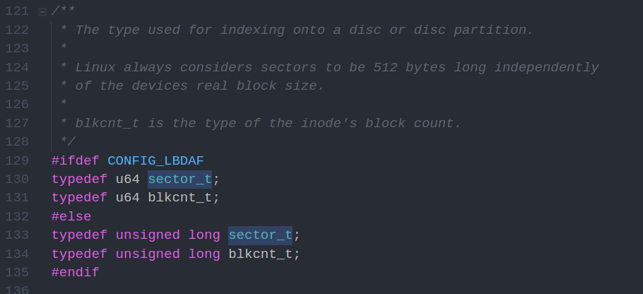
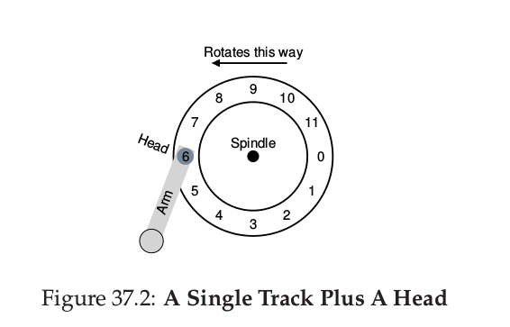
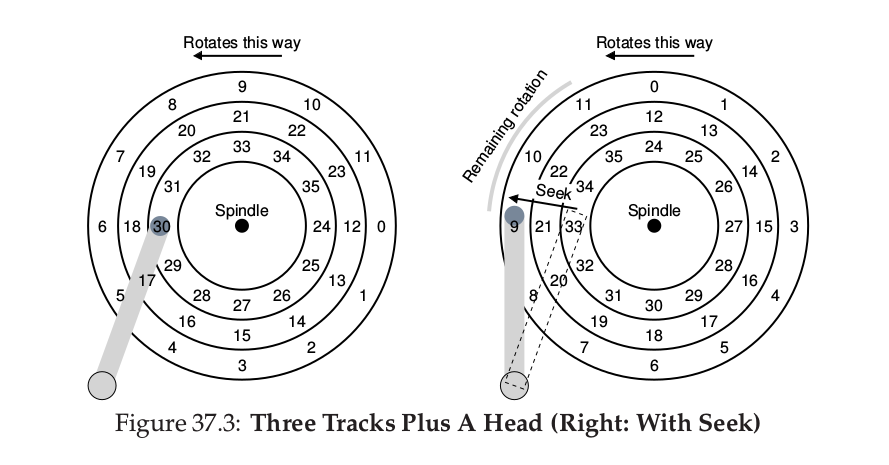
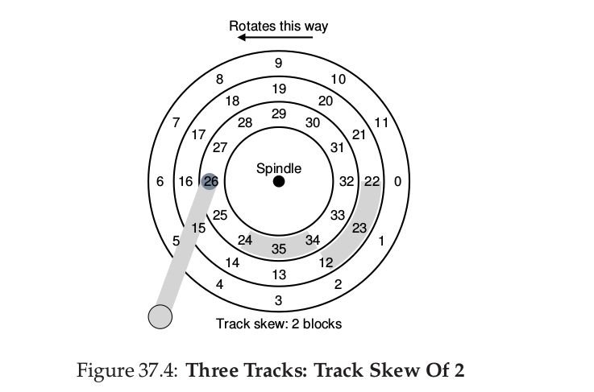

Operating Systems: Three Easy Pieces
=====================================

这是OSTEP的持续性部分章节的笔记.

<!-- TOC -->

- [1. chapter 36, I/O Devices](#1-chapter-36-io-devices)
    - [1.1. System Architecture:现代计算机的逻辑结构](#11-system-architecture现代计算机的逻辑结构)
    - [1.2. A Canonical Device:IO设备的组成是什么样的](#12-a-canonical-deviceio设备的组成是什么样的)
    - [1.3. Canonical Protocol:简单的IO协议](#13-canonical-protocol简单的io协议)
    - [1.4. Canonical Protocol:带有中断功能的IO协议](#14-canonical-protocol带有中断功能的io协议)
        - [1.4.1. 不是所有IO设备都适合使用中断机制.](#141-不是所有io设备都适合使用中断机制)
        - [1.4.2. 中断机制的维护可能会抢占用户线程的时间片](#142-中断机制的维护可能会抢占用户线程的时间片)
        - [1.4.3. 中断组合(coalescing)](#143-中断组合coalescing)
    - [1.5. Canonical Protocol:更高效的DMS方式](#15-canonical-protocol更高效的dms方式)
    - [1.6. Methods of Device Interactio:设备的寻址方式](#16-methods-of-device-interactio设备的寻址方式)
    - [1.7. Fitting Into OS: Device Driver:外包一样的驱动](#17-fitting-into-os-device-driver外包一样的驱动)
- [2. chapter 37, Hard Disk Devices](#2-chapter-37-hard-disk-devices)
    - [2.1. Basic Geometry:硬盘的物理结构](#21-basic-geometry硬盘的物理结构)
    - [2.2. The Interface:硬盘的接口及特性](#22-the-interface硬盘的接口及特性)
    - [2.3. A Simple Disk Drive:一个简单的硬盘工作示例](#23-a-simple-disk-drive一个简单的硬盘工作示例)
        - [Single-track Latenc:The Rotational Delay](#single-track-latencthe-rotational-delay)
        - [Multiple Tracks:Seek Time](#multiple-tracksseek-time)
        - [Other Details:Track Skew,Track Buffer](#other-detailstrack-skewtrack-buffer)
    - [I/O Time:Doing The Math](#io-timedoing-the-math)
    - [Disk Scheduling](#disk-scheduling)
- [3. chapter 38, Redundant Arrays of Inexpensive Disks(RAIDS)](#3-chapter-38-redundant-arrays-of-inexpensive-disksraids)
- [4. chapter 39, Interlude: File and Directories](#4-chapter-39-interlude-file-and-directories)
- [5. chapter 40, File System Implementation](#5-chapter-40-file-system-implementation)
- [6. chapter 41, Locality and The Fast Fils System](#6-chapter-41-locality-and-the-fast-fils-system)
- [7. chapter 42, Crash Consistency:FSCK and Journaling](#7-chapter-42-crash-consistencyfsck-and-journaling)
- [8. chapter 43, Log-structured File Systems](#8-chapter-43-log-structured-file-systems)
- [9. chapter 44, Data Integrith and Protection](#9-chapter-44-data-integrith-and-protection)
- [10. chapter 47, Distributed Systems](#10-chapter-47-distributed-systems)
- [11. chapter 48, Sun's Network File System(NFS)](#11-chapter-48-suns-network-file-systemnfs)
- [12. chapter 49, The Andrew File System(AFS)](#12-chapter-49-the-andrew-file-systemafs)

<!-- /TOC -->
# 1. chapter 36, I/O Devices

## 1.1. System Architecture:现代计算机的逻辑结构

简单介绍一下现代计算机的系统结构.

现在的计算机由几个重要的逻辑部件连接在一起:CPU,Memory,Bus,I/O设备.总线是贯穿整个结构的概念,它分级连接了多个逻辑部件.按传输速度从高到底,Memory Bus连接CPU和内存,General I/O Bus连接一些高速IO设备(图形显卡,DMA等),Perpheral I/O Bus连接低速IO设备(SATA磁盘,鼠标等).

示意图如下.

## 1.2. A Canonical Device:IO设备的组成是什么样的

一个标准的IO设备由Interface和Internal Structure组成.接口具有一些寄存器,定义了操作系统和本设备的交互方式(那个寄存器用来输入,哪个用来输出,哪个用来查询状态,哪个用来控制状态等);内部结构可能具有一个小CPU,内存等各种芯片,负责设备逻辑的具体实现.

## 1.3. Canonical Protocol:简单的IO协议

IO接口大概有这几种寄存器:Status,Command,Data,分别有不同的用途.

我们需要有一份IO协议,来规定IO应该如何接受工作任务,CPU应该如何提交工作命令,也就是交互方式.这里有一份简化的交互协议,大概经过几个步骤:

* CPU等待IO设备空闲
* 等待完成后,将数据写入到IO设备的接口的Data寄存器中
* 将命令写入Io设备的接口的Command寄存器中,IO开始工作
* CPU检查IO设备接口的状态,查看工作是否成功完成.

这种简化的协议显然效率太高,CPU经常出现轮讯操作.

## 1.4. Canonical Protocol:带有中断功能的IO协议

不再多说,已经很熟悉了.只介绍一两点.

### 1.4.1. 不是所有IO设备都适合使用中断机制.  

对于速度较快的设备,中断带来的上下文切换开销是不容忽视的,不如直接使用上面简单的轮训方式.也可将两种方式混合在一起,就像linux下的futex,spin wait一段时间后陷入Bock.  

### 1.4.2. 中断机制的维护可能会抢占用户线程的时间片

如果在某个场景中,中端频繁出现,可能会导致没有机会去真正服务这些IO事件.比如网络,数据包不断到来,如果频繁陷入中断处理,就无法快速对数据包作出响应.这样的情景,就需要更多的干预措施,让系统真正处理数据包,做相应的计算任务.

### 1.4.3. 中断组合(coalescing)

由于中断会带来额外开销,我们有理由尽量优化这种开销.可以通过中断组合的方式,把一段时间内到来的中断聚集成同一个中断事件,让系统一次性处理.

比如在网络环境中,当一定数量的数据包到来,才引发中断,而不是一个包一个中断.

## 1.5. Canonical Protocol:更高效的DMS方式

前两种IO协议中,都需要CPU将输出数据从IO复制到内存,或者是把输入数据从内存复制到IO设备,显然是比较耗费时间的.

DirectMemoryAccess就是针对这种情况作出的优化措施,也不多说.

## 1.6. Methods of Device Interactio:设备的寻址方式

这个其实就是IO与CPU交互的两种方式,定义了CPU如何向CPU发起请求.基本方式还是通过指令来完成,区别在于是采用特有的指令寻址方式还是统一的寻址方式.

就是IO统一编址和非统一编址,也不再多说,几个老师已经把这个分析了无数次.

## 1.7. Fitting Into OS: Device Driver:外包一样的驱动

因为IO设备众多,操作系统懒得为每个IO设备提供操作指令代码.于是OS用一种外包的形式,抽象出了设备驱动.IO设备的生产厂家按照不同操作系统的不同规范,自己写好设备驱动(因为只有他们自己最清楚细节),提供给OS使用.

值得注意的是,**大部分操作系统的代码是关于设备驱动的**(Linux的代码中有70%是和设备却动相关的).

# 2. chapter 37, Hard Disk Devices

这一章介绍一种非常重要的IO设备:硬盘.

## 2.1. Basic Geometry:硬盘的物理结构

硬盘的结构比较复杂,先放上一张图,再逐一解释.

* 磁盘(platter)  
    硬盘最主要的部分是磁盘,而且有多个磁盘.数据读写主要发生在磁盘上.

* 磁盘面(surface)  
    磁盘有两面,每一面都可以独立地进行数据读写.每个面上都有非常多的扇区.

* 扇区(sector)  
    扇区可以算是最底层的存储介质了.扇区一般是512Bytes大小的存储块,数据的读写直接发生在扇区上.在win下,如果扇区没有写满数据,就会产生"磁盘碎片",其实就是指扇区内部空闲下来的数据快.  

* 磁道(track)  
    扇区的形状是类似扇形的,多个扇区排列在一起,就组成了一个完整的圆环,这个圆环就是磁道.多个圆环组合在一起,就成了一个磁盘面.可以想到,因为扇区的大小固定,所以每个扇区的面积是一致的,与是,不同磁道上的扇区数量不同.越往外围,磁道的扇区越多.一个surface会有上千个track紧密排列在一起.

* 转轴(spindle)  
   所有的磁盘会围绕一个转轴为中心(当然,不是所有磁盘都同时旋转),以固定的速度进行旋转.这个速度叫做rotations per minute(RPM),这个参数是衡量硬盘性能的重要指标之一.
    
* 磁头(disk head)
    磁头完成对扇区的读写工作,并且,一个磁盘的每个磁盘面都有一个磁头.

* 磁臂(disk arm)  
    磁臂连接着磁头,会在磁盘面上移动,将磁头移到需要访问的磁道上.

## 2.2. The Interface:硬盘的接口及特性

简单来说,硬盘对自己的内部结构进行了抽象,只保留扇区的概念.它把自己的存储空间按照特定的扇区大小进行编号(地址空间),读写的时候,只需要制定扇区编号,底层的磁头定位扇区全部被自动完成.

可以通过Linux源码来印证这一点,下面就是Linux4.9对于扇区号的定义,如果一个扇区是512Bytes,32位系统下差不多可以承载最多2TB的硬盘大小.

这里也有一些特性:

* 磁盘驱动保证,对一个扇区的写操作是原子性的.当一批数据被写到一系列扇区,如果突然断电,只有一部分扇区的写操作会出现问题.

* 磁盘驱动没有作出这样的保证,但一般情况下是成立的:
    * 对地址空间上相邻的两个扇区进行操作,比相距较远的两个扇区快.
    * 对连续的扇区进行读写,比离散的扇区读写要快.

## 2.3. A Simple Disk Drive:一个简单的硬盘工作示例

我们通过逐步还原硬盘的真实情况来介绍.

### Single-track Latenc:The Rotational Delay

以这个简单的硬盘模型为例.这个硬盘只有一个磁盘,一个磁盘面,一个磁道,磁道上有12个扇区,依次编号为0,1,2,..,11.

现在disk head在sector6,如果想要访问sector11,需要等待磁盘旋转半周.如果旋转一周的时间是R,则还需要R/2的时间去等待磁头到位.如果想要访问sector5,则几乎要等待R时间.

这个旋转一周的时间R很重要,严重影响硬盘性能,这个时间也叫做旋转延迟(RotationalDelay).

### Multiple Tracks:Seek Time

如果一个盘面有多个磁道,磁头的就位还需要更多的时间.在上面的图中,一共有3个磁道,扇区从0到35分布在不同的磁道上.

现在磁头在sector30(左图),想要访问sector11.首先,磁臂需要移动到最外层,再等待sector旋转到磁头下,完成读写操作.

磁臂的移动有这几个步骤:  
* 向外圈加速
* 滑行
* 减速
* 稳定(settling)

以上过程叫做**seek**,花费的时间叫做**Seek Time**.其中最重要的是settling time,磁头需要在这个时间内判定是否到达了需要访问的磁道.

### Other Details:Track Skew,Track Buffer

* track skew  
    这个是指扇区编号的偏移.这个偏移可以让磁头到达下一个磁道时,刚好能遇到这个磁道最开始的扇区,从而避免需要访问的扇区旋转过头了.

* Track Buffer  
    这个就是一种缓存.类似于内存的高速缓存.
    
## I/O Time:Doing The Math

硬盘一次IO的时间=SeekTime+RotationalDelay+TransferTime

一般来说,**SeekTime+RotationalDelay远大与TransferTime,可能相差2,3个数量级**.

对于访问的扇区分布情况,分布连续和分布随机两种情况下,IO时间的差距非常大.一般来说,**分布随机的IO时间是分布连续的IO时间几百倍**,因为每次随机访问都需要进行seek和rotation,并且这两个操作的时间远大与一次数据读写的时间(transfer time).所以,在使用磁盘IO时,尽量加大每次IO操作的数据大小,让他们尽可能分布在相邻的扇区,从而达到近似连续访问的效果.

## Disk Scheduling

# 3. chapter 38, Redundant Arrays of Inexpensive Disks(RAIDS)

# 4. chapter 39, Interlude: File and Directories

# 5. chapter 40, File System Implementation

# 6. chapter 41, Locality and The Fast Fils System

# 7. chapter 42, Crash Consistency:FSCK and Journaling

# 8. chapter 43, Log-structured File Systems

# 9. chapter 44, Data Integrith and Protection

# 10. chapter 47, Distributed Systems

# 11. chapter 48, Sun's Network File System(NFS)

# 12. chapter 49, The Andrew File System(AFS)

