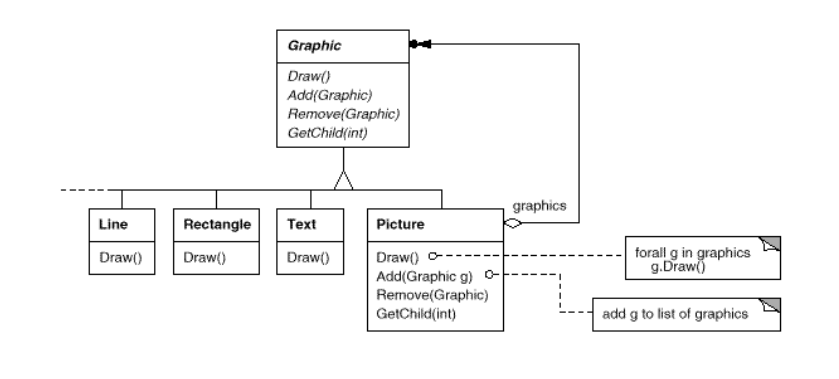
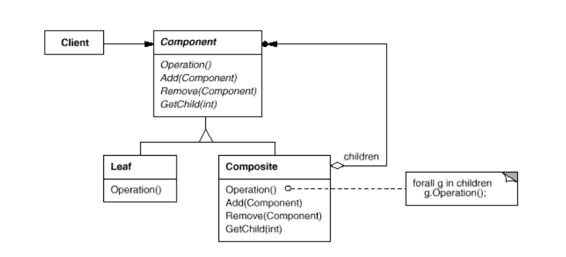
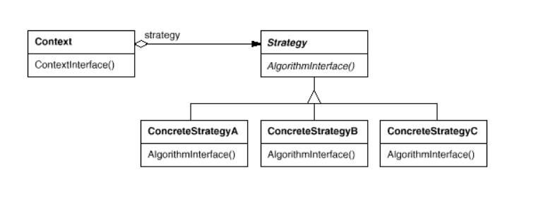
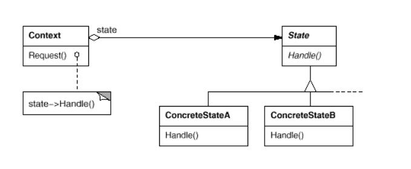
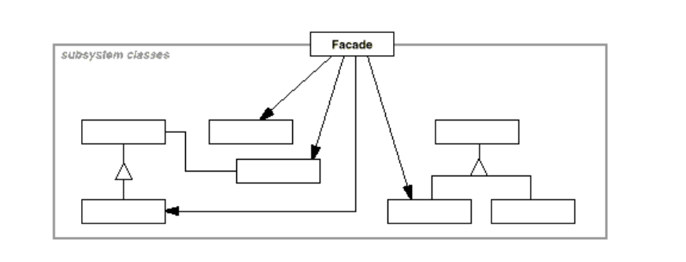
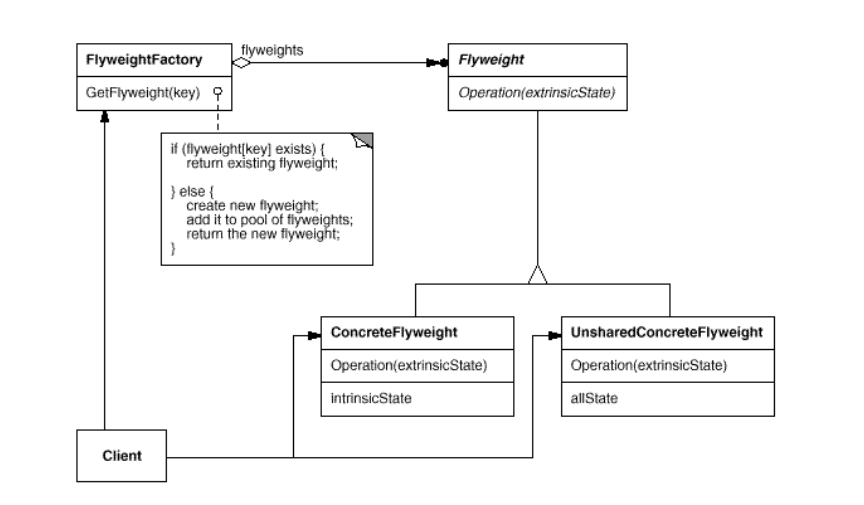
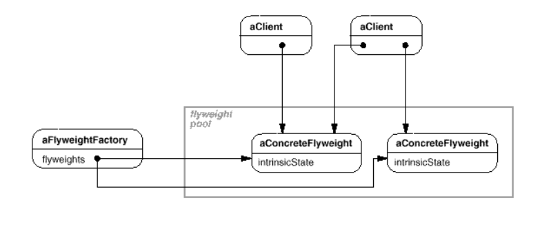
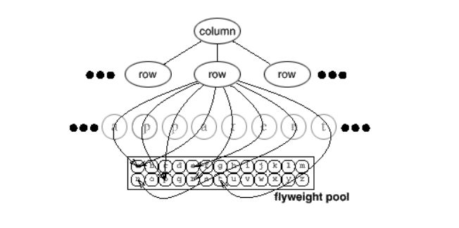

设计模式
===

这是一篇关于设计模式的学习笔记。内容可能并不深刻，主要意义在于备忘。

本文会对设计模式的主要问题进行概览，再根据面向对象设计需要解决各个问题来讨论设计模式。本文会充斥大段的文字，并且相对抽象。

<!-- TOC -->

- [概览](#概览)
    - [什么是设计模式](#什么是设计模式)
    - [设计模式如何分类](#设计模式如何分类)
    - [类(class)和类型(type)的区别](#类class和类型type的区别)
    - [针对接口编程，而不是针对实现编程](#针对接口编程而不是针对实现编程)
    - [聚合与相识](#聚合与相识)
    - [应用，类库和框架](#应用类库和框架)
- [如何寻找合适的对象](#如何寻找合适的对象)
    - [Composite模式](#composite模式)
    - [Strategy模式](#strategy模式)
    - [State模式](#state模式)
- [如何决定对象的粒度](#如何决定对象的粒度)
    - [Facade模式](#facade模式)
    - [Flyweight模式](#flyweight模式)
    - [Abstract Factory模式](#abstract-factory模式)
    - [Builder模式](#builder模式)
    - [Visitor模式](#visitor模式)
    - [Command模式](#command模式)

<!-- /TOC -->

## 概览

### 什么是设计模式

设计模式是一种面向对象的思想，它主要探讨：**如何设计出可复用的类**？具体涉及到如何设计类，以及类之间的交互。前辈们在几十年的实践基础上，总结出一套经验，帮助程序员避免陷入到无止尽的重复设计中，这套经验被总结成一系列的设计模式。

设计模式在1994年就被总结出来了，到现在有了25年多的历史。编程语言在这期间发展迅速，很多原来需要设计模式解决的问题已经能够被语言语法糖轻而易举解决掉，比如Stragety模式可以被函数对象替代。**很多设计模式已经不再那么使用，我们应该以一种参考的态度去学习，而不是当成SilverBullet来膜拜**。

### 设计模式如何分类

要想讨论一种思想，必须理清它内部的脉络。对于设计模式，就是要弄清楚：不同的设计模式之间有什么共性、差异，在应用、效果上有什么优劣不同。后者需要具体到每种设计模式，我们先就前者，对设计模式进行分类。

按照设计模式的**效果**，即它们的用途，可以分为三类：  
* 结构型设计模式，主要讨论类的组织结构，比如一个类如何组织自己，是包含其他类，还是直接继承。 
* 行为型设计模式，主要讨论类的行为方式，比如一个类的状态改变如何影响到其他类，从而协同完成一些任务。  
* 创建型设计模式，主要讨论类对象的创建方式，比如是直接只用类型关键字来创建对象，还是设计复杂的方法，在这个方法里完成一系列的初始化动作。  

按照设计模式的**作用对象**,分为两类：  
* 作用于类，即是处理类和子类之间的关系，主要包含静态的继承。
* 作用与对象，即使处理不同对象之间的关系，主要包含动态的交互方式。

### 类(class)和类型(type)的区别

对象具有类和类型两个属性，对象的类定义、实现了对象的结构和接口，类型则只定义好了对象的接口。可以联想到Golang中的面向对象，只要一个对象满足某些接口，就可以说他是某种类型。

### 针对接口编程，而不是针对实现编程

这一点对我的触动特别大。

直到现在，我还处在针对实现编程的阶段。设计一个类时，我总是把它支持的操作理出来，杂糅到类的定义里。这样一来，我只关注了这个类具有什么操作，如何组织成员变量从而实现这些操作，但**没有关注操作之间的关系，以及操作和其他类的关系**。这样说可能很费解，如果这个类中的某些方法，在其他类中也出现了，那么是不是应该把他们抽象出来进行复用呢？很显然，我在设计类时，没有考虑这个问题，所以类的复用仅限于调用接口，一旦出现了类似的类，就不得不再实现整个方法集合。

所谓面对接口编程，就是**提倡让对象遵从某些接口，而不是让对象成为某种具体的类的实例**。前者能够减轻模块之间的耦合，因为**上下游不用关心双方间的交互对象到底是属于什么类，只需要知道这个对象能够提供哪些接口**。这里就是在讨论继承的作用了，我们不管指针到底指向什么类的实例，我们只需要知道，通过这个指针我们能获得哪些操作。

### 聚合与相识

聚合是指，**类对自己的成员变量负责，它拥有这个变量，关注变量的状态变化**。二者的生命周期几乎相同，存在很强的耦合关系。

相识是指，**类只是认识自己的成员变量，但不拥有这个变量，只需要调用它的接口**。二者的生命周期不同，类可以随时替换一个新的成员变量，只要新成员变量能够满足接口约定，而不必为成员变量执行构造/析构操作，耦合关系相对聚合要弱。

就代码的语法层次而言，聚合与相识是很难区分的。他们的区别更多的体现在代码实现。这一点可能看起来不怎么实用，但在编码时，还是常常会体会到二者带来的不同设计思想。

### 应用，类库和框架

现在来讨论设计模式对于三种软件的作用：

* 应用。应用的复用性主要在于应用内部，我们并不期待这个应用可以直接用于将来的某个需求，而仅仅要求能满足当前的业务场景。**设计模式主要靠减小耦合，从而提高应用内部的复用，减少设计、代码量**。我们使用设计模式来孤立、封装一个操作，使它在各种场景下都可以被直接使用，并且不依赖或很少依赖于其他组件。
* 类库。不同于应用，类库更多的强调灵活性。它更加关注基础设施的构建，比如一些数据结构、算法、IO操作，都属于类库提供的典型功能。
* 框架。框架规定了应用的体系结构。比如，在一个web应用中，框架规定了你在哪个概念里实现url设计，在哪个概念里实现数据库操作等。框架限制了应用在代码上的表现形式，使得我们只需要填充这个框架的细节，而不用重新设计系统的概念层次，**这将大大减少我们需要作出的设计决策**。

## 如何寻找合适的对象

通常，我们针对某个行为，写出一个主谓宾结构的句子。句子的主语、谓语、宾语都可以成为一个对象。这里的主谓宾可能比较明显，但往往存在一些不明显的概念，也需要设计成对象。设计模式可以帮我们确定并不明显的抽象，并提供一些对象来描述这些抽象。

### Composite模式

解决问题：**使得用户可以忽略单个对象和对象组合体的差异，调用统一的接口**。

这个模式在图形界面库里被广泛使用。举个例子：

Line、Rectangle、Text是一系列简单的图元，而Picture是相对复杂的组合图元，可以是Line、Rectangle等图元的组合提。看起来两类概念差别很大，实际上完全可以忽略掉：无论图元是简单的还是复杂的，使用图形界面的用户总是会调用Drow()接口，来呈现这个图元。

那么我们可以采用如下的结构来设计类：

Line、Rectangle、Text和Picture都是(is-a)Graphic，并且都具有Drow()接口;Picture作为组合图元，可以聚集一系列基本图元，通过调用它们的Drow()接口来实现自己的Drow()接口。同时，Picture实现了自己的图元管理接口，从而管理基本图元。

更一般地，composite模式可以被归纳为Component(组件)和Composite(合成物)的组合。

<!-- [这里](composite)提供了组合模式的实现。 -->

### Strategy模式

解决问题：**封装一系列相似的算法，并使他们可替换**。

当业务需求发生变化，比如对时间复杂度、空间复杂度的要求改变了，我们可以通过Stragety模式，实现几乎没有代价的算法切换。

如果不使用Strategy模式，在传统的C++中，我们可能把具体算法嵌入到类的实现里。如果需要添加新的算法，可能需要写一个新的类，或者是加一些分支语句来选择合适的算法。这种方法有个明显的缺点：随着算法的增多，代码会变得越来越复杂，影响可读性。而Strategy模式把算法工作委托出去，在类实现中几乎不设计到具体算法，解决了传统C++可能面临的问题。

Strategy模式主要由Context(上下文)、Strategy(抽象的算法类)、ConcreteStrategy(具体的算法类)组成，这是它的设计图：

Strategy模式可以为现实中不明显存在的概念建立类，与State模式有相似之处。值得注意的是，**Strategy看起来虽然很强大，但并不是那么实用**。因为，如果我们使用的语言支持函数式编程，能够支持函数对象(C++11开始就支持了lambda，Python、Java等也支持类似概念)，那么算法的切换也会变得非常简单，Strategy反而由于其类体系而处于劣势。

### State模式

解决问题：**允许一个对象在状态改变时，改变自身行为，看起来仿佛在修改这个类的实现**。

这个模式不打算仔细记录，我觉得它的思想实在是太普通了。当一个算法里有很多个状态，每个状态完成的任务不尽相同，并且状态变迁复杂，传统的switch语法并不适用。因为状态太复杂了，相关代码全部挤在一个switch里，是非常难看的;同时，如果添加了新的状态，就不得不修所有相关状态的处理代码，很难忍受这种修改发生在本来就长的代码里。

于是我们索性把状态抽象出来。每个状态负责本状态的具体工作，并负责状态变迁的控制。宿主类只要维护自己的状态变量，并把需要的参数传递给状态类提供的接口，就可以很直观的实现代码逻辑。

State模式由Context/State/ConcreteState组成，这是它的设计图：

如果你的代码本来就不长(可以在有限的代码量内实现)，也不会发生什么大的变动，根本就不用考虑这个模式。

## 如何决定对象的粒度

### Facade模式

解决问题：**为子系统的一组接口提供一致的界面**。

随着子系统的复杂化，子系统实现一个接口可能需要使用越来越多的类，但上层调用并不关系底层实现，也不需要知道子系统专用的类，所以我们可以提供一个界面(facade)，作为上层调用子系统的入口点。

外观模式很简单，由Facade/Subsystem classes组成。设计图如下：

### Flyweight模式

解决问题：**当一个系统中有大量的小对象，并且他们具有大量显著的外部状态，以及少数几个显著的内部状态，那么可以使用Flyweight模式,通过共享对象来减小空间开销**。

比如在一个编辑软件中，为了达到最大的灵活性，可以为每个字符设立一个对象。绘制界面时，依次调用字符对象的相关方法。这带来一个问题：字符对象太多，浪费了大量内存。字符本身是个内部状态，大概包括字符的unicode值;绘制时则涉及到大量的外部状态，比如字符的位置、字体、大小、颜色等。我们可以把内部状态设立成对象，外部状态则设立成接口参数。文本里的每个字都是一个对象，负责维护外部状态和内部对象引用。绘制时，每个子对象把外部状态写在参数里，调用内部状态对象的接口，完成绘制工作。而内部状态对象与unicode字符一一对应，如果多个不同的子对象具有相同的unicode字符值，那么他们引用的是同一个内部状态对象。

当然，外部状态也可以设立成对象，不一定要放到接口参数。另外，内部对象由于是共享的，需要设立专门的方法来创建他们。比如单例模式等。

Flyweight享元模式由Flyweight/ConcreteFlyweight/UnsharedConcreteFlyweight/FlyweightFactory/Client组成。

* `Flyweight`，一个抽象的接口类。
* `ConcreteFlyweight`，实现`Flyweight`的接口，维护内部状态。
* `UnsharedConcreteFlyweight`，实现`Flyweight`的接口，维护内部状态。与`ConcreteFlyweight`不同的是，`UnsharedConcreteFlyweight`不被共享，因为这个模式并不强制我们去共享每个内部状态。
* `FlyweightFactory`，用于创建、管理Flyweight对象。
* `Client`，维护一个`Flyweight`的引用，维护多个外部状态的数据。由这个类完成对  `Flyweight`的调用。

设计图如下：

这个图更好的说明了，ConcreteFlyweight是如何被共享的：

在编辑软件的例子中，内部状态、外部状态的共享情况可以这样说明：

Flyweight模式的思想可以用于实现State模式和Strategy模式，起到节省空间的作用。

### Abstract Factory模式

### Builder模式

### Visitor模式

### Command模式